<!-- spellcheck-language "ptbr" -->

# Introdução

A área denominada Inteligência Artificial é um dos campos da ciência mais explorados na atualidade, estando presente em uma gama crescente de aplicações que vão desde o entretenimento [[@risi2017neuroevolution]]{custom-style="cit"} à saúde [@esteva2017dermatologist], passando por campos como segurança digital [@aljumah2016novel] [@omar2017predicting], entre inúmeros outros.

Sundar Pichai, CEO do Google desde 2015, afirmou recentemente em um discurso no Fórum Econômico Mundial de 2018 que a inteligência artificial é provavelmente a área mais importante na qual a humanidade já trabalhou, equiparando sua importância à eletricidade e ao fogo e declarando ainda que esta tecnologia é o coração do Google [@parker_2018]. Dave Coplin, *Chief Envisioning Officer* da Microsoft, afirmou no *AI Summit* de 2016, que a inteligência artificial é a tecnologia mais importante em que todos estão trabalhando no momento [@shead_2016]. Um das páginas [@amazon] do website da Amazon é dedicada à explicar o que é inteligência artificial, e deixa clara a importância do aprendizado de máquinas (*machine learning*), uma de suas subáreas, em algumas das competências essenciais da companhia.

Isso ajuda a entender a importância do campo no modelo de negócios de algumas das maiores empresas do mundo, já que esse interesse é acompanhado por outras gigantes da tecnologia, como Apple e Facebook. Na contramão desse movimento, no entanto, observa-se uma escassa penetração dessas tecnologias na industria de instrumentos virtuais, acompanhado de um baixo volume de pesquisas ne área; Um levantamento bibliográfico na base Scopus revela que trabalhos relacionados à utilização de redes neurais para a simulação de instrumentos musicais ainda são bastante escassos, a despeito do sucesso desta ferramenta em iniciativas afins.

O potencial de inovação nesse campo é sugerido pelo papel central (muitas vezes representando o estado da arte) que as redes neurais artificiais vem desempenhando em áreas diretamente correlatas, com o campo de síntese de voz, ou ainda em campos menos obviamente relacionados, à exemplo dos grandes avanços na área de visão de computadores (*computer vision*), como a geração de imagens e vídeos.

Esses resultados estimulam a transposição de algumas dessas inovações para o contexto da síntese sonora, além do desenvolvimento de novas abordagens. Nesse contexto, o presente trabalho investiga, a partir de diferentes perspectivas, o potencial de aplicação dos recentes desenvolvimentos na área de redes neurais à modelagem de instrumentos acústicos, com vistas à síntese sonora em tempo real.

Ênfase é dada a instrumentos de caráter percussivo, no sentido de sistemas em que o som é gerado por uma excitação inicial, aproximadamente impulsiva do ponto de vista físico, e a subsequente vibração livre do(s) componentes pertinentes do instrumento. Esse é o caso, por exemplo, do conjunto de peças de uma bateria ao serem golpeados, das cordas ou conjuntos de cordas de um piano acionadas pelo martelo ao ser alavancado pelo pressionar das teclas e, em uma aproximação mais livre, a excitação causada pelos dedos ou palheta em instrumentos de corda.

Do ponto de vista da indústria, embora o interesse por instrumentos musicais digitais tenha crescido bastante na última década [@staudt2016development], os instrumentos virtuais de ponta, utilizados em estúdios para gravações profissionais ainda baseiam-se prioritariamente em coleções de amostras sonoras pré-gravadas [@smith2008digital], demandando uma alta quantidade de memória em disco e razoável poder de processamento do *hardware* (em geral computadores) utilizado.

Em plataformas onde o poder de processamento e armazenamento são limitados, como é o caso de teclados digitais e baterias eletrônicas, por exemplo, é comum que esses instrumentos sejam guarnecidos com bibliotecas de menor tamanho e qualidade, suficientes apenas para a prática do instrumento; a qualidade de produção é alcançada apenas conectando-se o instrumento à um computador, e usando-o como controlador de um VST de forma a acessar técnicas de manipulação e coleções de amostras sonoras de melhor qualidade.

O foco em algoritmos neurais voltados à síntese em tempo real tem origem tanto na escassez de pesquisas sobre o tema quanto nas possibilidades mercadológicas: Aumentos de eficiência e redução do tamanho em memória ocupado pelo modelo podem, por exemplo, basear implementações mais verossímeis e baratas nessas plataformas dedicadas.

## Questão de pesquisa
O objetivo geral deste trabalho é desenvolver um modelo de simulação em tempo real de instrumentos acústicos que tire proveito do estado da arte relacionado à redes neurais artificias para exibir maior eficiência, quando comparado aos algoritmos tradicionais, dando origem a simulações mais realistas, principalmente do ponto de vista da percepção humana, e menos intensivas computacionalmente.
A lista abaixo enumera os objetivos específicos necessários à essa finalidade:

- Identificar técnicas baseadas no estado da arte das redes neurais artificiais que possam ser utilizadas na modelagem acústica;
- Identificar formas de compactas de representação das ondas sonoras mais adequadas à predição/generalização via redes neurais;
- Tendo em vista o foco na síntese em tempo real, identificar as arquiteturas e hiperparametros neurais mais eficientes,
- Identificar na literatura sobre modelos acústicos de instrumentos musicais ferramentas que possam ser utilizadas para simplificação e aumento de eficiência, tanto do modelo quanto das representações.
<!-- TODO: linkar com conclusões -->

## Escopo
O trabalho limita-se à emulação de instrumentos musicais acústicos convencionais e não aborda, senão tangencialmente, a área mais subjetiva de desenho de novos instrumentos, através de um exemplo em que um instrumento híbrido é apresentado; um tratamento razoavelmente completo do tema, pelo grande número de possibilidades que oferece (@dalgleish2014blurring), está além do objetivo deste trabalho.

Adicionalmente, limitar o escopo do trabalho à investigação de instrumentos que possam ser aproximados por um modelo de excitação impulsivo, como aqui é feito, possibilita excluir da observação uma subárea significativa do processamento de sinais que lida com a evolução das frequências de uma onda sonora no domínio do tempo, trazendo o volume de pesquisa a níveis práticos, sem uma perda substancial em termos conceituais.

Uma outra vantagem desse recorte é de cunho técnico, já que essa escolha reduz a duração média das ondas investigadas; investigações do comportamento de arquiteturas neurais densas e profundas, por exemplo, tornam-se computacionalmente custosas quando uma dimensionalidade muito grande é envolvida. Esse também é o comportamento de alguns dos algoritmos utilizados durante o trabalho, como a Transformada Discreta de Fourier.

<!-- Além disso, alguns dos algoritmos e técnicas convencionais, ainda que de forma muitas vezes ineficiente, prestam-se de maneira razoável à simulação *off-line* de instrumentos acústicos, razão pela qual o foco deste trabalho é a síntese em tempo real.  -->

Em relação ao tratamento das redes neurais, prioridade foi dada às arquiteturas já consolidadas na literatura, o que excluiu, por exemplo, uma investigação da promissora arquitetura Capsnet (@sabour2017dynamic @hinton2018matrix).
A escolha é necessária devido à limitações de tempo frente ao grande volume de pesquisas envolvendo novas arquiteturas.

## Estrutura do Trabalho e Síntese das Etapas de Pesquisa

Durante a revisão bibliográfica, após um breve resumo da evolução das redes neurais do ponto de vista histórico, o trabalho apresenta as arquiteturas mais relevantes encontradas na literatura. O objetivo é introduzir o tema, inicialmente de maneira ampla, lançando as bases para as seções seguintes, que exploram o estado da arte das aplicações dessas arquiteturas à 3 áreas de interesse: Música, discurso e imagens. Enquanto o interesse nas duas primeiras áreas é mais evidente, uma investigação dos desenvolvimentos em visão de computadores oferece insights importantes; além de ser uma das áreas do aprendizado de máquinas mais ativamente pesquisadas, alguns esforços de transposição dos desenvolvimentos nessa área para o campo da modelagem acústica tem alcançado resultados interessantes.

A seguir, algumas plataformas disponíveis são discutidas e comparadas; novamente, por limitações de tempo, ênfase foi dada aos com maior penetração tanto na indústria quanto na academia, e a escolha da plataforma utilizada nesse trabalho obedeceu mais à critérios de documentação, adoção na comunidade e flexibilidade, do que critérios relacionados diretamente à performance.

A seção seguinte investiga a modelagem acústica convencional, com ênfase no estado da arte da síntese sonora em tempo real. Por tratar-se de uma área mais hermética, sobretudo quando comparada ao campo de redes neurais e sua filosofia código aberto, alguns temas relevantes são apresentados com uma maior profundidade conceitual. Por esse mesmo motivo, implementações didáticas dos dois algoritmos mais utilizados são apresentadas.

Em seguida é apresentado um referencial teórico, onde são formalizadas algumas das bases conceituais do trabalho, como a equação da onda e o funcionamento, do ponto de vista matemático, de uma rede neural; ademais, uma interpretação geométrica para a simetria da transformada discreta de Fourier, quando aplicada a sinais no domínio dos números reais, é introduzida.

A seguir, no capítulo dedicado à metodologia, são apresentadas as etapas executadas, desde o processo de obtenção das amostras de som utilizadas na etapa de treinamento das redes, passando pelas investigações no domínio do tempo e da frequência, até a apresentação em mais detalhes do modelo final proposto, que tem seus resultados comentados na seção seguinte. Na conclusão algumas limitações e possibilidades de encaminhamentos futuros são apresentados.

## Relevância socio-econômica
Os computadores introduziram a produção musical em uma nova era, permitindo, por um lado, experimentações com novos timbres e formas de interação homem máquina para a criação musical e, por outro, a emulação de instrumentos tradicionais, através de técnicas promissoras, como a modelagem acústica (@bovermann2016musical).

Avançar essas pesquisas significa, na medida em que, por exemplo, diminui custos de *software* e *hardware* dedicados, oferecer a um maior número de pessoas acesso à educação musical e, por conseguinte, uma formação intelectual mais rica.

Algumas vantagens do acesso precoce à educação musical são delineadas no estudo de @forgeard2008practicing, que sugere uma maior habilidade verbal e uma maior capacidade de raciocínio não verbal em crianças que praticaram instrumentos em sua infância. Na mesma linha, o trabalho de @vaughn2000music aponta para uma relação entre o estudo voluntário de música e uma melhoria do desempenho matemático, a partir de uma meta análise de 20 estudos.

Uma outra motivação é estimular a descentralização do capital intelectual relacionado ao campo de instrumentos virtuais, desde a década de 70 fortemente concentrado em algumas empresas japonesas, situadas em sua maioria na cidade de Hamamatsu, como Yamaha e Roland (@reiffenstein2006codification). Essas empresas detém, exclusivamente ou parcialmente, as patentes para alguns dos mais importantes algoritmos de síntese sonora, como os *digital waveguides*.

# Revisão Bibliográfica
Após uma breve exposição sobre o nascimento e evolução das redes neurais, com o objetivo principal de conferir familiaridade à área onde o trabalho é desenvolvido, a revisão bibliográfica aqui apresentada assume um caráter pragmático, investigando na literatura, em especial no que tange as pesquisas relacionadas à área de redes neurais, técnicas pertinentes ao desenvolvimento do modelo proposto.

As última seção elenca de maneira bastante concisa o conteúdo relacionado à modelagem acústica "tradicional", limitando-se aos modelos fisicamente informados mais importantes para o trabalho em tela. A área de síntese digital, que tem aproximadamente a mesma idade da área de redes neurais é, talvez, mais extensa e errática do que esta em sua evolução, e o leitor interessado em uma revisão histórica mais abrangente é referido ao trabalho de @bilbao2009numerical, que delineia o desenvolvimento do campo desde sua origem em algoritmos abstratos.

## Redes Neurais Artificiais
Multidisciplinar desde o nascimento, o desenvolvimento das redes neurais artificiais pode ser remontado aos primeiros esforços para sistematização teórica da forma como o cérebro humano funciona, a partir dos trabalhos de Hermann von Helmholtz, Ernst Mach e Ivan Pavlov, na virada do século 19 [@hagan1996neural].

Em 1943, o neurofisiologista Warren McCulloch e o matemático Walter Pitts foram responsáveis por formular o primeiro modelo matemático conhecido do cérebro humano [@mcculloch1943logical], mostrando que topologias simples podem, em princípio, encarregar-se de operações aritméticas e lógicas [@yadav2015introduction] complexas. O trabalho desses autores é considerado o início da pesquisa na área de redes neurais artificiais [@russell2016artificial].

O termo Inteligência Artificial foi cunhado em 1956 por John McCarthy em uma conferência no Dartmouth College [@coppin2004artificial], da qual participaram muitos dos primeiros pesquisadores influentes na área [@brunette2009review].

Esse termo, assim como o próprio termo inteligência, não se presta a uma definição fácil; para o propósito deste trabalho, no entanto, pode ser entendido como um termo guarda-chuva sob o qual algoritmos que buscam emular aspectos da inteligência humana estão abrigados.

O termo aprendizado de máquinas, por sua vez, é utilizado para denominar um subgrupo da área de inteligência artificial, do qual fazem parte as redes neurais, que ocupa-se de técnicas que permitam que máquinas resolvam problemas sem que sejam explicitamente programadas para tal [@raschka2015python].

Na área mais ampla denominada de inteligência artificial, redes neurais artificiais possuem um papel primordial pois tem sido, em suas diversas encarnações e arquiteturas, o principal representante do aprendizado de máquinas em diversas aplicações comerciais [@goodfellow2016deep].

O primeiro passo para a utilização prática das redes neurais foi dado no final da década de 1950 por Frank Rosenblatt [@hagan1996neural], em sua proposta ao laboratório aeronáutico de Cornell de um autômato baseado em seu modelo simplificado de neurônio, o Perceptron [@Rosenblatt57].

Tomando como base também as teorias de McCulloch, Widrow desenvolveu a ADALINE (Adaptive Linear Neuron) [@widrow1960adaptive] bastante similar em estrutura ao modelo de Rosenblatt, e partilhando de suas limitações. O modelo de treinamento proposto, no entanto, era consideravelmente mais robusto.

A motivação final de Rosenblatt, inspirada nas teorias sobre o funcionamento do cérebro humano apresentadas por autores como Culbertson, Von Neumann e Ashby [@rosenblatt1958perceptron] era a construção de uma máquina capaz de aprender à responder diretamente à estímulos físicos externos, como sinais luminosos.

Para tanto, tal máquina utilizaria como unidade fundamental o Perceptron, que funciona matematicamente como uma função aplicada à soma ponderada das entradas e dos vieses dando origem a um classificador linear, capaz de atualizar seus pesos para aprender, através de exemplos de entradas e as correspondentes saídas desejáveis (alvos), a separar linearmente classes diferentes.

A despeito das limitações práticas do modelo proposto, como expostas de maneira um tanto pessimista por Minsky [@minski1969perceptrons], é interessante notar que muitas das características contemporâneas já estavam presentes nos trabalho seminais de Rosenblatt e Widrow, notadamente o caráter estocástico das redes neurais, a necessidade de treiná-las com base em grandes conjuntos de dados e a característica de caixa preta do modelo treinado.

É interessante observar que Widrow introduziu, como forma de treinamento, uma caso restrito do algoritmo de descida em gradiente, que veio a ser amplamente responsável pelo ressurgimento do interesse em redes neurais décadas mais tarde, em conjunto com uma técnica mais eficiente de atualização dos pesos e vieses de uma rede.

O modelo de Rosenblat, tendo tido sua primeira implementação na forma de uma simulação em um computador IBM 704 [@bishop06], ao contrário da intenção inicial de utilizar hardware específico, inaugura também a prática da simulação neural.

Enquanto uma arquitetura baseada em uma única camada de Perceptrons apresenta severas limitações, o agrupamento sucessivo dessas camadas dá origem a uma topologia, conhecida como Multilayer Perceptron, capaz de atuar como um aproximador universal [@hornik91]. Desde que utilize uma função de ativação não-linear [@leshno93], e dado um número suficiente de neuronios na camada oculta, essa topologia é capaz de mapear qualquer conjunto de números finitos a qualquer outro com precisão arbitrária [@hornik89].

Um outro impedimento práticos do trabalhos de Rosenblatt e Widrow foi a ausência de uma metodologia eficiente para a atualização dos pesos da rede, sobretudo envolvendo múltiplas camadas de neurônios - caso não coberto pelos algoritmos iniciais tanto de Rosenblat quanto de Widrow; tal metodologia veio a ser proposta originalmente por Werbos em 1974 [@werbos1974beyond]. Contudo, essa técnica permaneceu pouco conhecida na comunidade até ser redescoberta por Parker [@parker1985learning] e, pouco tempo depois, Rumelhart[@rumelhart1985learning] na segunda metade da década de 1980 [@mizutani2000derivation] [@widrow199030].

O algoritmo, que é conhecido como *backpropagation*, foi um dos responsáveis por reaquecer o interesse no campo[@hagan1996neural] na época, inaugurando sua fase atual, com o surgimento dos principais congressos sobre o assunto, como o *IEEE International Conference on Neural Networks* e periódicos, a exemplo do *INNS Neural Networks*, ao fim da década de 1980 [@yadav2015introduction].

Nos anos seguintes, observou-se uma profusão de novas arquiteturas, que foram aprofundando-se na media em que a utilização de um maior número de camadas ocultas foi possibilitada pelos avanços no *hardware* computacional. Outras formas de organizar camadas sucessivas foram também introduzidas, além de vários avanços incrementais nos algoritmos de treinamento.

## Redes Neurais - Principais Arquiteturas
Esta seção apresenta as principais arquiteturas consolidadas na literatura, dando ênfase às arquiteturas relevantes ao trabalho aqui desenvolvido. Para uma apresentação mais abrangente, ainda que não exaustiva, o leitor é referido à página preparada pelo The Asimov Institute [@veen_2018](http://www.asimovinstitute.org/neural-network-zoo/), onde uma gama maior de arquiteturas é elencada, junto com referência aos artigos onde foram introduzidas.

### Redes Densas
A arquitetura básica no campo das redes neurais artificiais é a chamada densa (*Feed-Forward*), que consiste de várias camadas sucessivas totalmente ligadas entre si por meio de pesos. Os impulsos recebidos pelas camadas mais baixas fluem sucessivamente para as camadas posteriores, como sugere a nomenclatura em inglês desta arquitetura. São uma generalização do Multilayer Perceptron na medida em que utilizam em geral uma gama mais vasta de funções de ativação, muitas delas de forma sigmoidal, como a função logística $y = \frac{1}{1 + e ^ {-x}}$ e a tangente hiperbólica $\tanh(x) = \frac{e^x − e^{-x}}{e^x + e^{-x}}$ [@goldberg2016primer]

### Redes Neurais Profundas
Com a melhoria do hardware, a topologia densa foi recebendo um acréscimo de camadas, gerando as redes profundas (Deep Neural Networks). O aspecto mais importante dessa movimentação foi que as redes ganharam a habilidade de gerar representações sucessivas, abstraindo diferentes aspectos dos dados em cada uma de suas camadas.

A grande vantagem desta topologia foi sua capacidade automática de extração dos componentes descritivos dos dados, um trabalho que ficava a cargo dos pesquisadores anteriormente [@socher2014recursive]. Em contrapartida, a forma como os dados são interpretados pela rede pode não ser facilmente inferida pelo pesquisador, e as redes podem assumir uma forte característica de caixa-preta. 

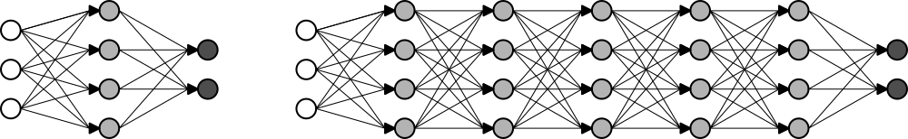{#fig:dense}

[Fonte: Elaboração própria]{custom-style="fonte"}

A +@fig:dense observa-se uma representação esquemática de duas arquiteturas densas: uma rede "rasa", à esquerda, e uma arquitetura profunda, à direita. Os círculos brancos representam as entradas da rede, enquanto os pretos representam suas saídas. Em cinza, temos a representação dos neurônios que compõe as camadas ocultas da rede.

### Redes Recorrentes
As redes recorrentes são representações compactas, do ponto de vista técnico, das arquiteturas profundas [@schmidhuber2015deep], devido ao seu caráter recursivo. Conceitualmente, contudo, a abordagem é distinta:
Nestas redes os neurons são parcialmente alimentados com seus próprios estados anteriores, emulando um efeito similar à utilização de ligações entre neurons de uma camada anterior com neurons de uma camada posterior não adjacente [@veit2016residual].

Essa arquitetura foi proposta por Elman [@elman1990finding] com o propósito de capturar
informações codificadas no encadeamento temporal de séries de dados, e é bastante poderosa em várias aplicações, como modelos de previsão e classificação de informações [@xu2015ccg], por exemplo.

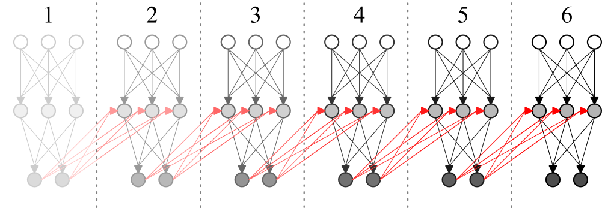{#fig:recur}

[Fonte: Elaboração própria]{custom-style="fonte"}

A +fig:recur representa 6 passos iniciais de uma rede recorrente. Observa-se que em cada passo, a partir do primeiro, a rede recebe, além do vetor de entrada externo, as próprias saídas que gerou no passo anterior. É oportuno notar que, em algumas aplicações, a rede recebe apenas um vetor de entradas, no primeiro passo, e opera em todos os passos seguintes processando suas entradas anteriores, em uma configuração que recebe o nome de um para muitos (*one-to-many*) na literatura.

### Redes Convolucionais
Trata-se de um tipo de arquitetura, geralmente profunda, que é amplamente utilizado em problemas relacionados a imagens, atingindo resultados de ponta em várias áreas relacionadas à visão de computadores, como reconhecimento de objetos e rostos em imagens [@pang2017convolution].

o problema da alta dimensionalidade dos vetores de entrada, como é o caso da representação de uma imagem por exemplo, é amenizado através da substituição de camadas totalmente conectadas por camadas convolucionais, que varrem a imagem, movimentando-se em cada uma de suas dimensões um passo por vez cada vez [@lecun1998gradient], e atualizando todos os pesos da camada convolucional de acordo.

Esse procedimento permite a geração, nessas camadas convolucionais da rede, de uma só representação para padrões que aparecem em diferentes pontos do vetor de entrada; tais representações são geralmente interpretadas em camadas posteriores, totalmente conectadas, de forma a gerar o resultado final.

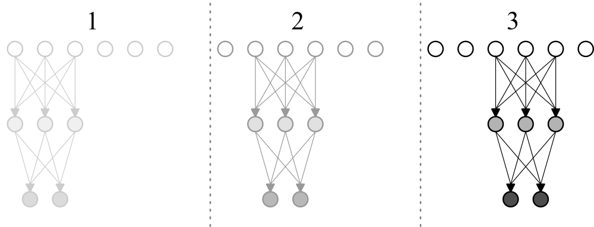{#fig:arqconv}

[Fonte: Elaboração própria]{custom-style="fonte"}

Na +fig:arqconv é possível acompanhar as 3 primeiras entradas de uma rede convolucional unidimensional: o vetor de entrada é "varrido" pela rede, geralmente andando um passo à cada leitura, em um processo análogo à definição matemática de convolução. O trabalho de @dumoulin2016guide apresenta uma exposição de vários tipos de convolução, dentre as quais a convolução básica em duas dimensões, apresentada na +fig:conv

{#fig:conv}

[Fonte: @dumoulin2016guide]{custom-style="fonte"}

## Redes Neurais Aplicadas à Musica

A maioria dos trabalhos que investigam a aplicação de redes neurais à música, sobretudo envolvendo sua síntese, ocorrem em um nível de abstração mais alto do que a geração direta dos sons: Geralmente tomam como base a manipulação de representações musicais como partituras, por exemplo, ou representações sonoras compactas, como espectrogramas. Os motivos passam pela alta dimensionalidade dos outputs: no caso de um *framerate* de 44100 samples por segundo, a qualidade encontrada em cds, por exemplo, a síntese de 10 segundos de áudio envolve a criação de mais de 4 milhões de samples.

O trabalho desenvolvido em conjunto pelas equipes do Google Brain team e do DeepMind é um exemplo de esforço nesse sentido [@engel2017neural]. Nele, uma arquitetura desenvolvida a partir da Wavenet (aprofundada no tópico sobre discurso falado) é utilizada para a geração de ondas sonoras a partir do treinamento direto com amostras de áudio de vários instrumentos musicais. Os resultados mostram que a arquitetura baseada em várias camadas convolucionais utilizada é capaz de aprender representações no domínio do tempo para vários tipos de instrumentos diferentes.

Uma extensão experimental desse trabalho, denominada de Magenta (@magenta), investiga representações latentes para sequências musicais no domínio do tempo, a partir de uma abordagem probabilística (@roberts2018learning @roberts2018hierarchical).

Uma plataforma física para a manipulação e reprodução dos sons gerados pela rede, na forma de um *hardware* código aberto denominado *Nsynth Super* ([@google] [@eck_2018]) é introduzida pela equipe do projeto. Embora não fique claro se a etapa de síntese ocorre diretamente na plataforma, os esforços corroboram o interesse aplicação de redes neurais para a síntese sonora em tempo real.

Enquanto as camadas das arquiteturas anteriores são predominantemente convolucionais, @pfalz2018generating apresenta um trabalho bastante abrangente sobre o uso de redes neurais recorrentes puras para essa finalidade. Um dos primeiros trabalhos na área é, talvez, o desenvolvido por @stanley2007compositional, consistindo na investigação da capacidade de uma rede em prever sons, em analogia direta com séries temporais. Os resultados são bastante tímidos, e uma rede capaz de prever apenas uma onda sonora, oriunda de uma nota de saxofone, é apresentada. De maneira semelhante, @sarroff2014musical investiga a aplicação direta de redes neurais, de arquitetura densa, na geração direta de múltiplas amostras de áudio

A geração de música em níveis mais altos de abstração é, para o trabalho aqui desenvolvido, apenas marginalmente interessante, na medida em que pode oferecer inspiração sobre representações compactas dos sons. O trabalho de [@hutchings2017talking], por exemplo, utiliza tablaturas para a previsão de partes completas de bateria tomando como base o ritmo de uma de suas peças.

Tomando emprestados os desenvolvimentos obtidos na área da visão de computadores, os trabalhos de @grinstein2017audio e @mital2017time buscam transpor os avanços alcançados no campo da transferência de estilo entre imagens para o domínio do som. O primeiro, de cunho exploratório, investiga as arquiteturas mais promissoras para a tarefa, chamando a atenção para o desempenho de arquiteturas rasas, enquanto o segundo investiga, a partir da Wavenet, representações apropriadas. Ainda inspirado em técnicas relacionadas à geração de imagens, @donahue2018synthesizing faz uso de GANs para a síntese direta de áudio, no contexto da emulação do discurso falado, gerando resultados inteligíveis.

Os esforços de classificação costumam introduzir inovações interessantes nas representações utilizadas:[@costa2017evaluation] e [@choi2016automatic] abordam a tarefa a partir de redes convolucionais; no primeiro trabalho as redes são alimentadas com música representada por um tipo especial de espectrograma enquanto no segundo arquiteturas convolucionais profundas são investigadas, assim como em [@choi2017convolutional] que acrescenta recorrência às arquiteturas convolucionais, no intuito de explorar as inter-relações temporais das amostras sonoras utilizadas.

Representações não canônicas também possuem importante papel nas tarefas relacionadas à transcrição musical a partir do uso de redes neurais, onde busca-se traduzir amostras sonoras em representações de nível mais alto, simbólicas, como tablaturas e partituras, por exemplo. Uma das primeiras contribuições nesse sentido pode ser vista em [@tuohy2006evolved] por meio de um modelo que combina redes neurais e uma heurística FIXME:*hill-climber*.

Com o uso de uma rede recorrente, [@boulanger2013high] transcreve, a partir de espectrogramas, diferentes partes musicais em comandos MIDI. Na mesma linha [@bock2012polyphonic] e [@sigtia2016end] introduzem trabalhos focados na transcrição de sons polifônicos produzidos por pianos. Em relação á transcrição de partes de um *kit* de bateria, [@southall2016automatic] aborda a tarefa a partir de uma arquitetura recorrente alimentada com representações espectrais.

## Redes Neurais Aplicadas ao Discurso Falado

Um dos trabalho mais notáveis nesse sentido, desenvolvido pela equipe de inteligência artificial do Google, é a chamada Wavenet FIXME: [@deepmind, @van2016wavenet], uma arquitetura baseada em camadas convolucionais, para a geração ponta a ponta de voz. Um sample é gerado por vez, levando em conta um grande número de entradas passadas; os resultados introduzem um novo estado da arte para a tarefa. Os desdobramentos dessa arquitetura na área musical foram apresentados na seção anterior.

[@hinton2012deep] apresenta uma revisão da literatura sobre o uso de modelagem acústica em abordagens baseadas em redes neurais na área de reconhecimento de voz. No mesmo ano [@graves2013speech] alcança resultados no *TIMIT phoneme recognition benchmark*, com a aplicação de redes recorrentes profundas, que estabelecem o novo estado da arte, enquanto [@maas2013rectifier] aponta a superioridade da função de ativação relu (*rectifier nonlinearities*) sobre ativações de caráter sigmoidal em tarefas relacionadas ao reconhecimento contínuo da fala.

A partir de uma arquitetura hibrida, combinando um modelo fonético recorrente com um classificador acústico baseado em uma rede neural profunda, [@boulanger2014phone] aplica estratégias de sequenciamento telefônico para estabelecer um novo benchmark no *TIMIT dataset*, uma técnica que foi comprovada por [@sak2015fast] como superior ao uso de arquiteturas como *deep long short-Term memory recurrent neural networks* e as abordagens mais utilizadas à época baseadas no modelo oculto de Markov.

Com relação à utilização de redes convolucionais, @sainath2015deep investiga a otimização de seus hiperparametros, além de estratégias de *pooling* e treinamento para aplicações em reconhecimento de fala, enquanto @zweig2017advances e @zhang2017towards exploram o desempenho de sistemas baseados somente em redes neurais (*end-to-end*), com o último combinando redes convolucionais hierárquicas com classificação temporal coneccionista. Nessa mesma linha, o trabalho de [@zhang2017very]também investiga sistemas *end-to-end* a partir de uma arquitetura combinando redes neurais convolucionais profundas com recorrência e princípios baseados no aninhamento de redes neurais (NIN, *network in a network*). Alguns desses princípios, notadamente a justaposição de convolução e recorrência, inspiraram a implementação apresentada no capítulo TODO:

<!-- O estado da arte da síntese sonora ainda não foi estabelecido por abordagens totalmente baseadas em redes neurais, embora pesquisas nesse sentido sejam abundantes, e estejam rapidamente aproximando-se da qualidade necessária para a implementação em produtos finais. O trabalho de [@zen2015unidirectional] aborda a tarefa a partir de uma rede recorrente com camadas FIXME:LSTM (long short-term memory), enquanto [@wu2016investigating] investiga a influência de aspectos específicos dessa topologia em sua eficiência na tarefa de síntese da voz falada. -->

## Redes Neurais Aplicadas à Imagem

Recentemente tem-se visto esforços para adaptar métodos utilizados com sucesso na área da visão de computadores ao campo da modelagem acústica. O trabalho de [@engel2017neural], citado TODO:, batizado de Nsynth, busca inspiração na área de geração de imagens para elaborar uma arquitetura apropriada a síntese sonora.
Ainda em paralelo com a área de relacionada à imagens, o autor propõe um base de dados sonora à luz de bases de dados clássicas no campo de visão de computadores, como o MNIST, em um esforço para alavancar pesquisas nessa direção.

Da mesma forma a Wavenet, antecessora do Nsynth, é uma adaptação das arquiteturas PixelRNN [@oord2016pixel] e PixelCNN[@van2016conditional], desenvolvidas para a geração de imagens. 

Os trabalhos que tem como foco a síntese de imagens geralmente envolvem as chamadas GANs:
trata-se de uma abordagem onde uma rede é treinada para gerar imagens, enquanto outra as classifica em artificiais ou não. O objetivo da primeira rede é enganar a segunda, dando origem a imagens mais realistas, do ponto de vista da percepção humana.

@isola2016image, por exemplo, utiliza essa técnica para gerar imagens a partir de representações de seus contornos, enquanto @hwangimage, @zhang2016colorful, @larsson2016learning e @iizuka2016let abordam a tarefa de colorização automática de imagens.

Ainda usando redes adversariais [@frans2017outline] introduz controle ao processo de colorização, com a utilização de mapas de cores, que são usados como entradas para as redes, um conceito que é explorado também por @sangkloy2016scribbler, onde a interação do usuário e uma rede densa permitem a colorização de imagens em tempo real, através de linhas desenhadas em áreas da imagem que possuam as cores pretendidas.

@gatys2016image propõe uma técnica de transferência de estilo, utilizando uma rede convolucional capaz de aprender características do estilo de uma imagem e transferir para outra, sem alterar o seu conteúdo semântico. Nessa linha,[@kulkarni2015deep utiliza uma arquitetura de convolução-desconvolução para separar características de posicionamento de uma imagem, permitindo sua reconstrução posterior em outras posições e situações de iluminação, a partir de mudanças manuais nas variáveis de entrada da rede.
Ainda investigando a manipulação de imagens a partir de redes adversariais o trabalho de @zhu2016generative tem como objetivo aprender características das imagens de maneira direta.

O trabalho de @oord2016pixel, que veio a inspirar a Wavenet, propõe um topologia recorrente profunda com conexões residuais melhoradas capaz de reconstruir imagens parcialmente obstruídas, enquanto [@theis2015generative] investiga arquiteturas LSTM multi dimensionais no contexto da modelagem da distribuição de imagens.

Na área de vídeo, que pode ser entendida como um caso geral da manipulação de imagens, com complexidades adicionais relacionadas à alta dimensionalidade dos dados e ao encadeamento temporal @karpathy2014large investiga abordagens capazes de estender as redes convolucionais de forma a permitir que tirem proveito das características temporais dos dados de entrada. De forma semelhante, portando desenvolvimentos na área de reconhecimento de expressões faciais obtidos em imagens, @khorrami2016deep combina redes recorrentes e convolucionais, medindo a importância relativa de cada uma nos resultados finais.

Buscando combater a alta dimensionalidade, @Yang2017 apresenta o conceito de *tensor-train*, permitindo a transferência de conhecimento de outras arquiteturas para a utilização em dados sequenciais com alta dimensionalidade. O trabalho de @he2015multimodal introduz novos benchmarks à tarefa de reconhecimento de emoções em vídeos, utilizando uma arquitetura profunda baseada em camadas LSTM bidirecionais no processamento de vídeos, incluindo seu áudio.

## Redes Neurais - Ferramentas e Frameworks

A área de aprendizado de máquinas encontra-se muito ativa atualmente, tanto no âmbito da academia quanto no da indústria, com várias grandes empresas de tecnologia incorporando essa tecnologia em suas competências essenciais. Dessa forma, assistimos à uma proliferação de ferramentas e plataformas focadas em diferentes aspectos da área, muitas delas desenvolvidos ou endossados por essas empresas, como Microsoft, Google e Amazon. Somando-se a isso o fato de que, em maior ou menor grau, todos eles apresentam uma curva de aprendizado significativa, fica evidente que uma comparação direta de todos, ou mesmo da maioria das ferramentas disponíveis, encontra-se além do escopo deste trabalho.

Algum direcionamento, contudo, pode ser obtido a partir da literatura disponível. @bahrampour2016comparative, por exemplo, compara quatro ferramentas: Caffe [@caffe], desenvolvida pelo grupo de pesquisas em inteligência artificial de Berkeley [@bair]; Neon [@neon], desenvolvido pelo setor de inteligência artificial da Intel; Torch [@torch] e Theano [@theano] os dois últimos sem afiliações diretas com grandes empresas. O autor conclui pela superioridade da plataforma Theano, em termos de velocidade em geral e flexibilidade, chamando atenção para sua capacidade de auto-diferenciação.

Embora o time principal tenha abandonado o desenvolvimento do Theano no final de 2017 a plataforma Tensorflow [@tensorflow], introduzida por pesquisadores do *Google Brain Team* em 2015 é, em muitos aspectos, sucessora do Theano, conservando a maioria de suas características. 

Se um estudo realizado pelo mesmo autor em 2015 [@bahrampour2015comparative] indicava alguma ineficiência da plataforma, à época ainda em sua infância, o trabalho de @shi2016benchmarking, ao comparar 5 plataformas, conclui que a situação 1 ano depois é diferente, e que não há uma plataforma sensivelmente superior às outras em termos gerais.

O trabalho de @erickson2017toolkits é ainda mais abrangente, comparando 12 *frameworks*, e chamando atenção para a importância das habilidades prévias e características da pesquisa na escolha da ferramenta mais apropriada. Na mesma linha, @parvat2017survey compara 5 plataformas, chamando atenção para as potenciais vantagens, em termos do tamanho do código e rapidez na criação de protótipos, da utilização de bibliotecas de nível de abstração mais alto, como a biblioteca Keras [@keras], no topo das plataformas convencionais.

## Síntese Sonora em Tempo Real

Excluídas as técnicas baseadas em manipulação de amostras pré-gravadas de sons, talvez a abordagem mais utilizada por músicos atualmente [@bilbao2009numerical], podemos dividir área de síntese sonora propriamente em duas escolas, na medida em que ocupa-se em modelar os processos físicos que dão origem ao som (Modelagem Física - *Physical Modelling*) ou diretamente as características das ondas sonoras (Modelagem Espectral - *Spectral Modelling*) [@serra2007state].

Dessas escolas, a modelagem física é a mais proeminente tanto do ponto de vista da pesquisa quanto de aplicações; a área de modelagem espectral parece ter despertado pouco interesse dos pesquisadores nas últimas duas décadas, encontrando a maioria de suas aplicações recentes em áreas fora da síntese musical. A modelagem física apresenta como principais vantagens um menor número de parâmetros, que costumam ser mais intuitivos, na medida em que são diretamente relacionados à grandezas existentes no mundo real.

Abordagens baseadas na modelagem física ocupam-se majoritariamente em formular modelos discretos baseados em descrições matemáticas dos instrumentos, como por exemplo a solução de D'alembert para a equação da onda [@karjalainen2004digital], normalmente incorporando ao modelo termos relacionados por exemplo à rigidez exibida por cordas não ideais, que modelem características relevantes ao timbre do instrumento representado [@bensa2003simulation]. Destacam-se, nessa escola, duas abordagens: o método das diferenças finitas, acurado e computacionalmente intensivo, e os *Digital Waveguides*, um modelo bastante eficiente [@bensa2005computational] e elegante que é, talvez, o mais utilizado para a emulação em tempo real de instrumentos acústicos.

### Método das Diferenças Finitas

A formulação mais básica desse método consiste na resolução da equação da onda propagando-se em uma corda ideal, introduzida abaixo e derivada com mais detalhes na seção seguinte.

$$\frac{\partial^2 y(x,t)}{\partial t^2} =\frac{T}{\rho} \frac{\partial^2 y(x,t)}{\partial x^2}$$ FIXME:

A solução é buscada para pontos em uma malha obtida discretizando-se tanto o tempo $t$ quanto a posição horizontal $x$. Isso permite a aproximação das derivadas parciais de segunda ordem pelo método das diferenças centrais. Assim procedendo, podemos reescrever a equação da onda como abaixo.

$$\frac{y[i,j+1]-2y[i,j]+y[i,j-1]}{\Delta t^2} = c^2 \frac{y[i+1,j]-2y[i,j]+y[i-1,j]}{\Delta x^2}$$

onde

$c=\sqrt{\frac{T}{\rho}}$

$x_i = i \Delta x, i \in \{0,1,...,M\}$

$t_j = j \Delta t, j \in \{0,1,...,N\}$

e, colocando $y[i,j+1]$ em evidência:

$$ y[i,j+1] = 2 y[i, j] - y[i,j-1] + C^2 (y[i+1, j] - 2 y[i, j] + y[i-1, j])$$

Em $C=c \frac{\Delta t}{\Delta x}$, denominado número de Courant, foram aglutinados todos os parâmetros que governam a qualidade da simulação. Para garantir sua estabilidade, os parâmetros devem ser fixados de modo que $C$ seja menor que 1.

Repare que $ y[i,j+1]$ é calculado com base no ultimo e penúltimo momentos discretos, o que demanda, para o primeiro passo da simulação em $j = 1$, a definição do estado inicial do sistema em $j=0$, e informações sobre o sistema no momento discreto indefinido $j=-1$. Essa última dificuldade será atacada a partir de considerações adicionais sobre o sistema.

Como condições de contorno para o caso contínuo temos que, no momento inicial, a corda encontra-se deslocada do seu equilíbrio, em repouso. Portanto, a velocidade em $t=j=0$, para qualquer ponto $x$ da corda, tem valor zero. Ademais, define-se a corda como fixa em suas extremidades nos pontos $x=0$ e $x=L$. Para primeira condição podemos escrever:

$$ \frac{\partial y(x,t)}{\partial t} \approx \frac{y[i,1]-y[i,-1]}{2 \Delta t} = 0 ~ \forall ~ i \in \{0,1,...,M\} $$

o que implica:

$$ y[i,1] = y[i,-1] ~ \forall ~ i \in \{0,1,...,M\} $$

Assim, para o primeiro momento da simulação em $j=1$ podemos substituir $y[i,-1]$ por $y[i,1]$, obtendo a equação para quando $j=0$:

$$ y[i, 1] = y[i, 0] + \frac{1}{2} C^2 (y[i+1, 0] - 2 y[i, 0] + y[i-1, 0])$$

Em relação à segunda condição, devemos reforças o fato de que $y[0, j] = y[L, j] = 0 ~ \forall ~ j \in \{0,1,...,N\}$ em cada passo da simulação.

É conveniente colocar a formulação em termos físicos: se considerarmos, por exemplo, um *framerate* típico de 44100 amostras por segundo podemos evitar desperdício computacional fazendo com que os passos da simulação coincidam com o intervalo de 1/44100 segundo entre os pontos amostrados. De modo geral, levando em conta que $C \le 1$, podemos parametrizar a simulação em termos dos componentes físicos e o *framerate* desejado da seguinte forma:

$dt = \frac{1}{FPS} = \frac{D}{N}$
$N = D ~ FPS$
$dx = \frac{L}{M}$
$M \le \frac{FPS}{2f}$
$c = 2fL$

onde $D$ é a duração desejada, em segundos; $L$ é o comprimento da corda em metros e FPS é o *framerate* pretendido.

O fragmento de implementação abaixo, na linguagem Python, faz as vezes de pseudocódigo e ajuda a ilustrar o funcionamento do algoritmo. A versão completa do código, com a possibilidade da geração do gráfico da onda, pode ser encontrada em @tesserato_2018, no caminho ["resources/Finite_Difference.py"](https://github.com/tesserato/Dissertacao/blob/master/Finite_Difference.py).

~~~{.python .numberLines}
amplitude = 0.005 # meters
pluck_position = .5 # fraction of L
pickup_position = .5 # fraction of L
fps = 44100 # samples / second
frequency = 440 #hz
duration = 1 # seconds
L = 0.6 # meters
sustain = .9998

N = int(duration * fps) # number of time points
dt = 1 / fps # spacing beetwen discrete time points
M = int(fps / (2 * frequency)) # number of position points
dx = L / M # spacing beetwen discrete position points
c = frequency * 2 * L # meters / second
C = c * dt / dx # Courant number
x = np.arange(0, M + 1, 1) * dx
t = np.arange(0, N + 1, 1) * dt
pickup = int(round(M * pickup_position))
asc = int(round(M * pluck_position))
dsc = M + 2 - asc
X_asc = np.linspace(0, 1, asc)
X_dsc = np.linspace(0, 1, dsc)[::-1][1: ]
y = np.zeros(M + 1)
y_1 = np.hstack([X_asc,X_dsc]) * amplitude * np.random.normal(1, .01, M + 1) # initial displacement shape
y_2 = np.zeros(M + 1)

ctr=0
w = []
for i in range(1, M):
  y[i] = y_1[i] + 0.5 * C**2 *(y_1[i+1] - 2*y_1[i] + y_1[i-1])
y[0] = 0
y[M] = 0
w.append(y[pickup])
y_2[:] = y_1
y_1[:] = y
ctr += 1
for j in range(1, N):
  print('step ', ctr,' of ', N)
  for i in range(1, M):
    y[i] = 2 * y_1[i] - y_2[i] + C**2 * (y_1[i+1] - 2*y_1[i] + y_1[i-1])
  y[0] = y[0] * 0.5
  y[M] = y[M] * 0.5
  y = y * sustain
  w.append(y[pickup])
  y_2[:] = y_1 
  y_1[:] = y
  ctr += 1
w = np.array(w) * 4000000
~~~

Uma animação relativa a uma onda de frequência real igual a 440 Hz, criada pela implementação acima, pode ser encontrado no repositório da dissertação [@tesserato_2018], no caminho ["resources/Demo Finite Difference/"](https://github.com/tesserato/tesserato.github.io/tree/master/resources/Demo%20Finite%20Difference), junto com áudios de diversas ondas, com locais de excitação e captação variados. É interessante observar o efeito da variação desses parametros no timbre da onda sonora gerada. Cabe notar que a velocidade e a escala da animação estão bastante distorcidas, para facilitar a visualização.

<video width="1000" controls>
  <source src="resources\Demo Finite Difference\FiniteDifference.webm" type="video/webm">
</video>

<audio controls preload> 
    <source src="resources\Demo Finite Difference\FD_440_Pluck_0-1_Pick_0-1.wav"></source>
</audio>

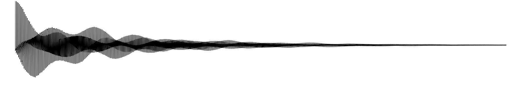

<audio controls preload> 
    <source src="resources\Demo Finite Difference\FD_440_Pluck_0-1_Pick_0-5.wav"></source>
</audio>

<audio controls preload> 
    <source src="resources\Demo Finite Difference\FD_440_Pluck_0-3_Pick_0-7.wav"></source>
</audio>

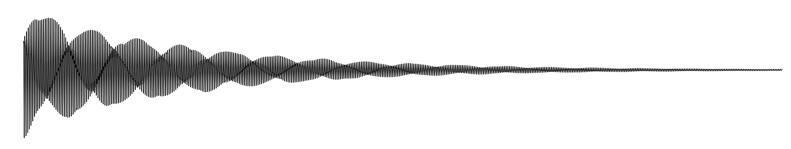

<audio controls preload> 
    <source src="resources\Demo Finite Difference\FD_440_Pluck_0-5_Pick_0-1.wav"></source>
</audio>

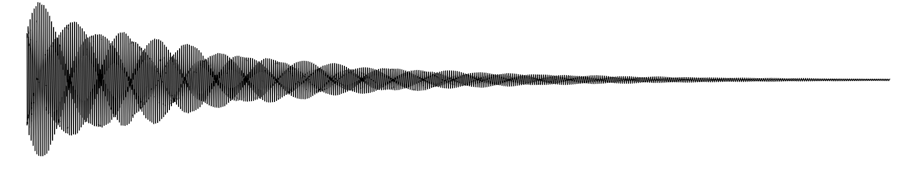

<audio controls preload> 
    <source src="resources\Demo Finite Difference\FD_440_Pluck_0-5_Pick_0-5.wav"></source>
</audio>

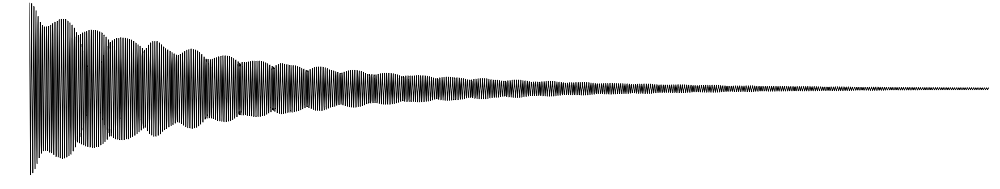

### Digital Waveguides

Esse algoritmo consiste em uma abordagem simplificada da modelagem física, na medida em que concentra em alguns pontos discretos os cálculos necessários à simulação, aumentando bastante a eficiência computacional do modelo [@van1995tetrahedral]. 

Conceitualmente, podem ser vistos como uma caso especial do método das diferenças finitas [@van1993physical] apresentado em FIXME:, e a maioria de suas implementações consistem na utilização de *delay lines* e filtros digitais para a modelagem da propagação da onda [@smith2006basic]. O modelo também parte da equação da onda FIXME:, discretizada da forma apresentada no contexto do método das diferenças finitas. A formulação analítica, no entanto, é abandonada, em favor de uma interpretação mais diretamente baseada na interpretação das duas ondas viajando em sentidos opostos na corda. A imagem abaixo apresenta a intuição do método, que representa ainda hoje o estado da arte da modelagem física [@bilbao2009numerical].

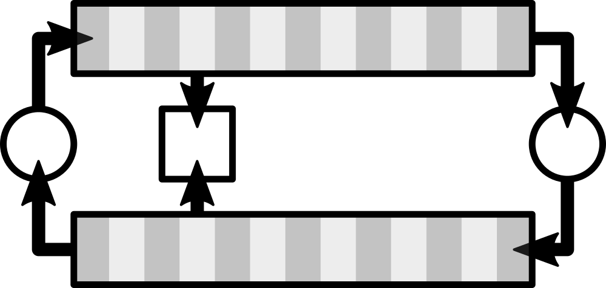

[Fonte: Elaboração própria]{custom-style="fonte"}

As duas linhas quadriculadas apresentadas na imagem FIXME: são as chamadas *delay lines*, por onde a onda circula inalterada, em uma direção: no exemplo, na linha superior a perturbação viaja da esquerda para a direita, e da direita para a esquerda na linha de baixo. Essa movimentação geralmente ocorre em uma estrutura de dados denominada *circular buffer*. O movimento de reflexão da onda quando alcança as extremidades fixas da corda é calculado nos pontos representados por cículos na figura FIXME: , que são responsáveis por enviar os *samples* de um *buffer* para o outro, invertendo seu sinal; nesses pontos, geralmente a partir da utilização de filtros digitais, outras manipulações são introduzidas, no sentido de emular perdas e fatores relacionados à rigidez de uma corda não ideal. O quadrado, na figura FIXME: representa a posição onde a onda é amostrada, a partir da soma do conteúdo das duas *delay lines*. Esse sistema, como um todo, recebe o nome de *digital waveguide*.

Do ponto de vista físico os *digital waveguides*, representam uma corda fixa em suas terminações, por onde um pulso viaja, sendo refletida nas extremidades. Ao passar de uma linha pra outra, a onda é espelhada e invertida e todos os cálculos são concatenados nesses pontos ou, dependendo da simulação, em apenas um desses pontos, como é o caso da implementação apresentada a FIXME:seguir, aumentando consideravelmente a eficiência da simulação.

 No modelo mais básico, um termo de perda é calculado durante a transição de uma linha para outra, enquanto implementações mais sofisticadas fazem uso dos filtros para emular além da rigidez das cordas, alguns outros fenomenos mais sofisticados, como dispersão, por exemplo. O modelo pode ser extendido também para emulações bidimensionais [@mullen2006physical] e tridimensionais [@fontana2000using] [@laird2001physical] [speed2012voice] , e presta-se à implementações bastante eficientes, principalmente em uma dimensão.

A seguir FIXME:, é apresentada um exemplo em Python, à guisa de pseudocódigo. Observa-se que a implementação é mais simples do que a do método das diferenças finitas, e mais eficiente, como a tabela a TODO:seguir demonstra. Como antes, a versão funcional do código pode ser acessada em @tesserato_2018, no caminho ["resources/Digital_waveguide.py"](https://github.com/tesserato/tesserato.github.io/blob/master/resources/Digital_waveguide.py), e uma animação ilustrando uma onda gerada pelo método, além dos com diferentes valores para o ponto de excitação e captação áudios, podem ser acessados no mesmo repositório, em ["resources/Demo Digital Waveguide/"](https://github.com/tesserato/tesserato.github.io/tree/master/resources/Demo%20Digital%20Waveguide)

~~~{.python .numberLines}
path = 'Demo Digital Waveguide/'
n = 44100
fps = 44100
frequency = 440
amplitude = 20000
pluck_position = .1
pickup_position = .1
sustain = .99
smoothing = 3
plot = True

L = int(round(fps / (2 * frequency)))
pickup = int(round(L * pickup_position))
asc = int(round(L * pluck_position))
dsc = L - asc
X_asc = np.linspace(0, 1, asc)
X_dsc = np.linspace(0, 1, dsc + 1)[::-1][1: ]
delay_r = np.hstack([X_asc,X_dsc])
delay_l = np.zeros(L)

w = np.zeros(n)
zeros = np.zeros(L)
for i in range(n):
  print('step ', i + 1,' of ', n)
  w[i] = delay_r[pickup] + delay_l[pickup]
  to_l = -1 * np.average(delay_r[-smoothing:]) * sustain # to add in delay_l[L-1] AFTER rolling
  delay_r = np.roll(delay_r, 1)
  delay_r[0] = -1 * delay_l[0]
  delay_l = np.roll(delay_l, -1)
  delay_l[L-1] = to_l
~~~

<video width="1000" controls>
  <source src="resources\Demo Digital Waveguide\DigitalWaveguide.webm" type="video/webm">
</video>

<audio controls preload> 
    <source src="resources\Demo Digital Waveguide\DW_440_Pluck_0-1_Pick_0-1.wav"></source>
</audio>

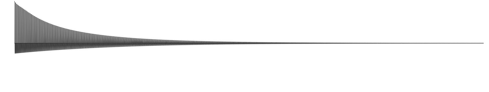

[Fonte: Elaboração própria]{custom-style="fonte"}

<audio controls preload> 
    <source src="resources\Demo Digital Waveguide\DW_440_Pluck_0-1_Pick_0-5.wav"></source>
</audio>

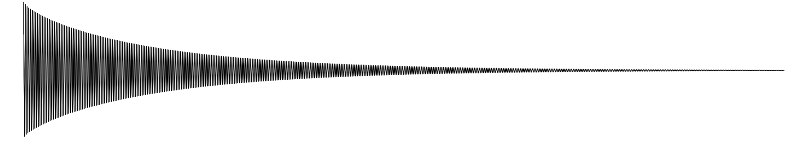

[Fonte: Elaboração própria]{custom-style="fonte"}

<audio controls preload> 
    <source src="resources\Demo Digital Waveguide\DW_440_Pluck_0-3_Pick_0-7.wav"></source>
</audio>

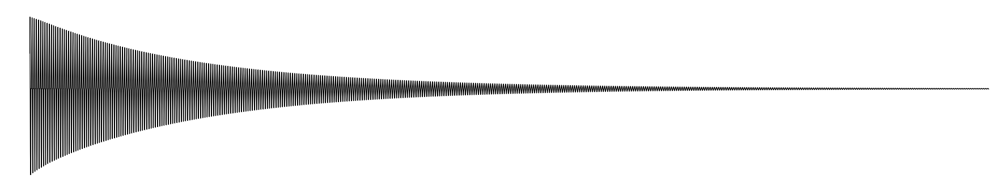

[Fonte: Elaboração própria]{custom-style="fonte"}

<audio controls preload> 
    <source src="resources\Demo Digital Waveguide\DW_440_Pluck_0-5_Pick_0-1.wav"></source>
</audio>

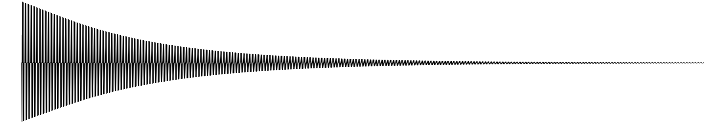

[Fonte: Elaboração própria]{custom-style="fonte"}

<audio controls preload> 
    <source src="resources\Demo Digital Waveguide\DW_440_Pluck_0-5_Pick_0-5.wav"></source>
</audio>

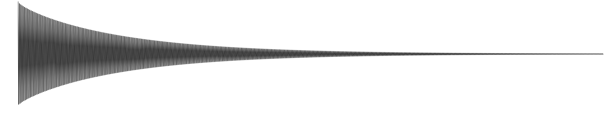

[Fonte: Elaboração própria]{custom-style="fonte"}

### Digital Waveguides X Diferenças Finitas

Para a comparação dos dois algoritmos, alguns exemplos de ondas equivalentes, geradas por ambos, foram preparados, a fim de basear um julgamento subjetivo. A figura FIXME: compara o primeiro frame e último das simulações da evolução do pulso em uma corda para os dois métodos.

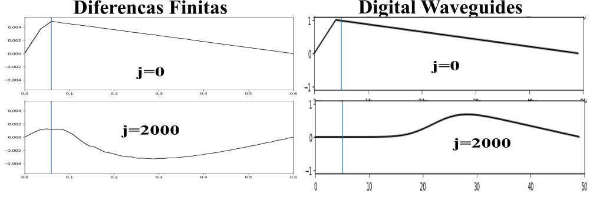

[Fonte: Elaboração própria]{custom-style="fonte"}

A movimentação da onda produzida a partir do método das diferenças finitas tem um caráter mais organico, enquanto é, também, mais propensa a desvios da condição de estabilidade, enquanto a simulação a partir do algoritmo de *digital waveguides* é mais robusta, porém mais mecânica Em relação às eficiências, abaixo são elencados os tempos que foram necessários para a geração dos sons apresentados nos TODO:capítulos anteriores. Todas as amostras tem *framerate* igual a 44100 FPS e duração de 1 segundo. Os tempos são apresentados em segundos.

Excitação | Captação | Digital Waveguides | Diferenças Finitas
:----:|:----:|:----:|:----:
0.1 | 0.1 | 13.811148881912231 |16.9521381855011
0.1 | 0.5 | 13.020658254623413 |19.620429277420044
0.3 | 0.7 | 11.332738161087036 |24.256462335586548
0.5 | 0.1 | 12.350087404251099 |17.89053726196289
0.5 | 0.5 | 12.122233390808105 |18.002467393875122
:Latência em segundos para uma onda com 44100 *samples*

[Fonte: Elaboração própria]{custom-style="fonte"}

# Referencial Teórico

O objetivo deste capítulo é oferecer uma definição mais formal das principais ferramentas utilizadas neste trabalho.

## Transformada Discreta de Fourier

A transformada de Fourier, em sua forma contínua, é um tipo de transformada integral, como abaixo:

$$
X(f) = \mathcal{F}(x(t))=\int_{-\infty}^\infty x(t) e^{- 2 \pi f t \ i} dt
$$

$$
x(t) = \mathcal{F}^{-1}(X(f))=\int_{-\infty}^\infty X(f) e^{2 \pi f t \ i} df
$$

Tendo sido formulada por Fourier, enquanto investigava o fenômeno da transferência de calor [@stein2003princeton], trata-se de uma das ferramentas mais utilizadas na investigação de sistemas físicos [@lyons2011understanding] [@olson2017applied].

Esta ferramenta parte da premissa de que qualquer sinal contínuo e periódico pode ser representado a partir de uma soma de senoides [@smith1997scientist] permitindo que a descrição de um sinal $x(t)$, em relação ao tempo, seja transformada em uma representação deste mesmo sinal em termos das frequências que o compõe, na forma $X(f)=\mathcal{F}\{x(t)\}$; $x(t)$ e $X(f)$ são denominados um par de Fourier.

A versão discreta da transformada de Fourier, apresentada abaixo, é uma das ferramentas mais importantes e utilizadas no campo de processamento de sinais [@gazi2018understanding]; contribui para essa penetração a descoberta de um algoritmo eficiente , denominado de *Fast Fourier Transform*, que diminuiu consideravelmente o número de operações necessárias ao cômputo da transformada discreta de Fourier [@pereyra2012harmonic].

$$
X[m] =\sum_{n=0}^{N-1} x[n] e^{- 2 \pi m n / N ~ i}
$$

$$
x[n] = \frac{1}{N}\sum_{m=0}^{N-1} X[m] e^{2 \pi m n / N ~ i}
$$

onde $x$ e $X$ são sequências de $N$ números complexos. Utilizando a fórmula de Euler, $e^{x ~ i} = \cos(x) + \sin(x)~i$, podemos alterar a definição acima, da forma exponencial, para a trigonométrica, reorganizando o expoente de forma a evidenciar algumas características importantes, na forma abaixo.

$$
X[m] =\sum_{n=0}^{N-1}
x[n] \cos \left(m ~ \frac{2 \pi}{N} ~ n \right)-
x[n] \sin\left(m ~ \frac{2 \pi}{N} ~ n \right) ~ i
$$

A forma acima torna mais fácil uma interpretação geométrica do algoritmo. Para cada valor de $m ~ \in ~ {0,1,2,...,N-1}$ é feita a multiplicação, elemento a elemento, das $N$ posições do impulso $x$ com $N$ posições de um onda em forma de cosseno ($C(m)$), pura, de "frequência" $m$, na parte real da equação. Analogamente, em sua parte imaginária, o mesmo processo ocorre: cada posição medida do impulso $x$ também é multiplicada pela posição equivalente, desta vez, de uma onda em formato de seno($S(m)$), com "frequência" $m$.

Note-se que esta "frequência", e por isso a insistência nas aspas, refere-se a quantos ciclos das ondas ($C(m)$) e ($S(m)$) acima definidas estão contidos no espaço dos $N$ pontos utilizados na transformada e não corresponde diretamente à frequência física da onda; essa relação é regida por $f_l = \frac{f_r}{FPS . N}$, onde $f_l$ é a frequência local, e $f_r$ sua frequência real, física.

Para o caso de sinais que, no domínio do tempo, consistem de uma sequência finita de números reais, como é o caso dos sinais considerados neste trabalho, pode-se, à luz da definição acima, derivar uma interessante e útil propriedade do algoritmo: A descrição do sinal no domínio da frequência é conjugado-simétrica em torno de sua mediana, de forma que $X[m] = X^* [N-m]$, com $X^*$ denotando o conjugado complexo de $X$. Dessa forma, sendo $N$ par, precisamos de apenas de $N/2+1$ termos de $X[m]$ para descrever completamente o pulso no domínio da frequência, enquanto $(N+1)/2$ são suficientes caso $N$ seja ímpar. A +@fig:rfft ilustra geometricamente essa propriedade.

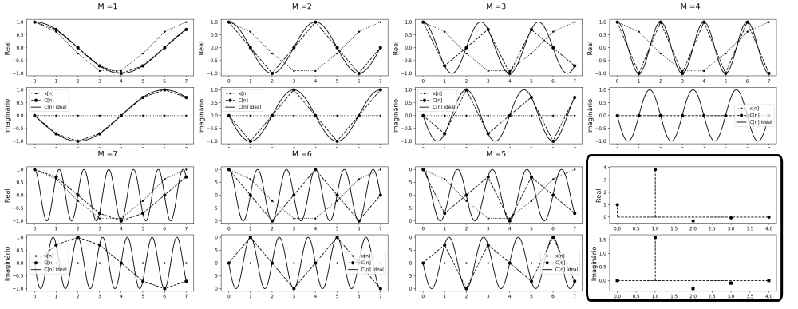{#fig:rfft}

[Fonte: Elaboração própria]{custom-style="fonte"}

Na +@fig:rfft é a presentado o resultado da transformada discreta de uma onda composta por 8 amostras, que pode ser vista no retangulo inferior da imagem. Os outros retangulos ilustram os respectivos passos e a simetria entre passos equidistantes de $n/2$. O motivo da simetria, causado pela perda de informação ao tomar apenas alguns pontos, torna-se explícito quando observado do ponto de vista geométrico: os 8 pontos equidistantes tomados como amostra, por exemplo, de uma senoide com frequência igual a 2 coincidem com os retirados de uma senoide com frequência igual a 6, já que partes do ciclo são ignorados.

O código em Python a seguir FIXME:, utilizado para gerar os quadros da +@fig:rfft, serve para elucidar numericamente o exposto. É interessante notar que a interpretação geométrica da simetria da transformada discreta de Fourier aplicada em ondas puramente reais, até onde alcança o conhecimento do autor, é apresentada pela primeira vez neste trabalho. Cabe observar que implementações mais eficientes, como o referido algoritmo FFT, utilizadas na prática, tiram proveito da simetria da transformada, entre outras alterações mais sofisticadas, para economizar operações [@sorensen1987real].

~~~~{.python .numberLines}
import numpy as np
import matplotlib.pyplot as plt
from scipy.fftpack import fft
# Discrete Fourier Transform | Transformada Discreta de Fourier
def DFT(x):
  N = x.shape[0]
  # cria um vetor de N entradas complexas, preenchido com zeros
  X = np.zeros(N, dtype='complex64')
  n = np.array([p for p in range(N)]) # n = {0,1,2,...,N-1}
  # Versão de "alta resolução" de n, usada para o gráfico apenas
  Hn = np.linspace(0, N-1, 100*N) # Hn ={0,...,1,...,2,...,N-1}
  for m in range(N): # m E {0,1,2,...,N-1}
    C_Si = np.exp(-2 * np.pi * m * n / N * 1j) # C(m) - S(m) i
    # Versão de "alta resolução" de C_Si, usada para o gráfico apenas
    HC_Si = np.exp(-2 * np.pi * m * Hn / N * 1j)
    X[m] = sum(np.multiply(x, C_Si)) # multiplicação termo a termo
    # plotando:
    plt.figure(1)
    plt.suptitle('M =' + str(m), fontsize=16)
    plt.subplot(211)
    plt.plot(n,x[n].real, 'k:.', label='x[n]')
    plt.plot(n,C_Si.real, 'k--o', label='C[n]')
    plt.plot(Hn,HC_Si.real, 'k-',label='C[n] ideal')
    plt.ylabel('Real', fontsize=14, color='k')    
    plt.subplot(212)
    plt.plot(n,x[n].imag, 'k:.', label='x[n]')
    plt.plot(n,C_Si.imag, 'k--o', label='C[n]')
    plt.plot(Hn,HC_Si.imag, 'k-',label='C[n] ideal')
    plt.ylabel('Imaginário', fontsize=14, color='k')
    plt.legend()
    plt.savefig('0' + str(m) + '.png', dpi=150)
    plt.close('all')
  #calcula o erro em relação ao algoritmo da biblioteca Scipy
  error = sum((X-fft(x))**2)
  print(round(error,5))
  # retorna a parte não redundante da transformada
  return X[0 : int(N/2+1)] if (N % 2 == 0) else X[0 : int((N+1)/2)]

def s(t):
  return np.cos(2 * np.pi * t)

t = np.linspace(0, 1, 8) # 8 pontos entre 0 e 1
x = s(t) # aplica a função ponto a ponto
X = DFT(x)
# plotando:
plt.figure(1)
plt.subplot(211)
plt.ylabel('Real', fontsize=14, color='k')
plt.stem(X.real,linefmt='k--',markerfmt='ko', basefmt='k--')
plt.subplot(212)
plt.stem(X.imag,linefmt='k--',markerfmt='ks', basefmt='k--')
plt.ylabel('Imaginário', fontsize=14, color='k')
plt.savefig('transform.png', dpi=150)
plt.close('all')
~~~~

## A Equação da Onda
A equação diferencial que descreve o movimento de uma onda em duas dimensões pode ser derivada a partir das leis de Newton, assumindo algumas simplificações [@ garrett2017understanding]. Considerando a imagem abaixo FIXME:: 

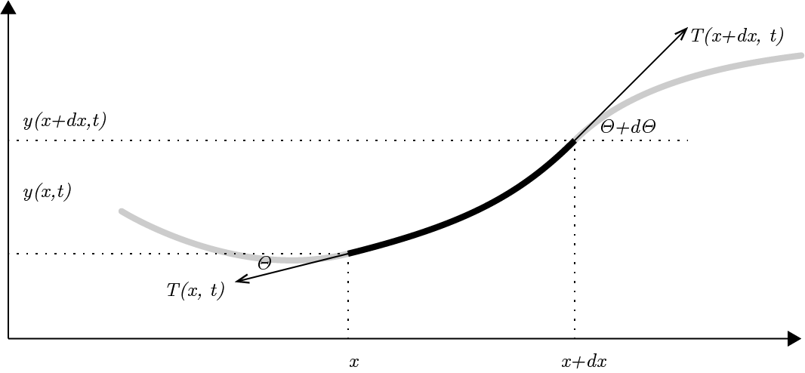

[Fonte: Elaboração própria]{custom-style="fonte"}

e as seguintes definições:

$y(x,t)$ a distância entre um ponto qualquer de uma corda e o eixo horizontal no tempo $t$ e na posição $x$;

$\theta(x,t)$ o angulo entre a tangente da corda na posição $x$ e no momento $t$ e a direção horizontal;

$\vec{T}(x,t)$ o vetor representando a tensão na corda, no ponto $x$ e no momento $t$;

Assumindo ainda que qualquer ponto da corda move-se somente na posição vertical temos que a resultante das forças é também vertical, e pode ser descrita como:

$$F(x,t) = T(x + dx,t)\sin(\theta + d\theta) - T(x,t)\sin(\theta) = 
T(x + dx,t)\cos(\theta + d\theta) \tan(\theta + d\theta) - T(x,t)\cos(\theta)\tan(\theta)$$

se considerarmos somente pequenos deslocamentos verticais da corda em relação à sua posição de equilíbrio, temos que $\theta \ll 1$ e, portanto $\cos(\theta + d\theta) \approx \cos(\theta) \approx 1$. 

Além disso, lembrando que as tangentes podem ser escritas como a derivada parcial da função de deslocamento em relação à posição, temos:

$$F(x,t) = T(x+d x, t) \left(\frac{\partial y(x+d x)}{\partial x}\right) - T(x, t) \left(\frac{\partial y(x)}{\partial x}\right)$$

Assumindo tensão uniforme e invariável em toda a extensão da corda, condições bastante razoáveis no contexto de instrumentos musicais, podemos escrever $T(x+d x, t) = T(x, t) = T$ e $F(x,t)$ toma a forma $ T \left(\frac{\partial y(x+d x)}{\partial x} - \frac{\partial y(x)}{\partial x}\right)$, quando colocamos $T$ em evidência. Se assumirmos que a massa do segmento infinitesimal da corda pode ser escrita na forma $\rho dx$, onde $\rho$ é a massa da corda por unidade de comprimento e $dx \approx \sqrt{dx^2+dy^2}$ para oscilações pequenas, aplicando a segunda lei de Newton para força resultante na corda temos $F(x,t) = \rho dx \frac{\partial^2 y}{\partial t^2} $. 

Assim, temos $T \left(\frac{\partial y(x+d x)}{\partial x} - \frac{\partial y(x)}{\partial x}\right) = \rho dx \frac{\partial^2 y}{\partial t^2} $ que podemos reorganizar como $\frac{\partial^2 y}{\partial t^2} = \frac{T}{\rho} \frac{\left(\frac{\partial y(x+d x)}{\partial x} - \frac{\partial y(x)}{\partial x}\right)}{dx}$. Notando que o termo à direita é a segunda derivada de $y$ em relação a $x$, chegamos à equação da onda:

$$\frac{\partial^2 y(x,t)}{\partial t^2} =\frac{T}{\rho} \frac{\partial^2 y(x,t)}{\partial x^2}$$

onde $v = \sqrt{\frac{T}{\rho}}$ é a velocidade de propagação da onda na corda.

Uma solução para essa equação, quando não há uma fonte de excitação, foi proposta por d'Alembert [@chaigne2016acoustics], na forma:

$$y(x,t)=F(x+vt)-G(x-vt)$$ 

Essa equação pode ser intepretada como dois pulsos viajando em sentidos opostos em uma corda ideal com velocidade $v$.

Em $t=0$ podemos escrever:

$y_0(x)=y(x,0)=F(x)-G(x)$

$v_0(x)=y'(x,0)=vF'(x)-vG'(x)$

$vF(x)-vG(x)= \int_{-\infty}^x v_0(\epsilon) d\epsilon$

O que nos dá um sistema de equações que, resolvido, nos permite reescrever a equação de d'Alembert em função das condições iniciais de deslocamento e velocidade na corda, como abaixo:

$$y(x,t)= \frac{1}{2} \Big(y_0(x+vt)-y_0(x-vt) \Big) + \frac{1}{2v}\Big(\int_{x-vt}^{x+vt} v_0(\epsilon) d\epsilon \Big)$$

Essa formulação é importante já que em muitos casos pode-se trabalhar apenas com o deslocamento inicial da corda, o que torna o termo à direita zero.

Alternativamente, pelo método da separação de variáveis, pode-se obter a solução em termos de um soma infinita de senoides estacionárias[@gracia2016wave]:

$$y(x,t)= \sum_{n=1}^{\infty} \big(a_n \cos(2 \pi f_n t) +  b_n \sin(2 \pi f_n t\big) \sin(\frac{n \pi x}{L})$$

onde considera-se uma corda de comprimento $L$ fixa em suas extremidades. $f_n$ são as frequências parciais da corda e são dados pela equação $\frac{nv}{2l}$. Além disso, os coeficientes $a_n$ e $b_n$ são dados pelos coeficiente da trasformada de Fourier das condições iniciais em $t=0$ ($y_0(x)$ e $v_0(x)$) [@salsa2016partial]

essas duas interpretações dão origem às duas escolas distintas de modelagem acústica, como referido anteriormente, uma focada no domínio do tempo e outra no domínio da frequência. Repare, no entanto, que ambas as soluções modelam uma corda ideal, não levando em conta a rigidez encontrada em cordas reais.

No domínio do tempo, [@smith1992physical] aponta que a rigidez implica no fato de que ondas com diferentes frequências viajam através da corda em velocidades diferentes, relação regida por $c(w) = c_0(\frac{1+kw^2}{2Kc_0^2})$ com $k = E \pi r^4 \pi / 4$ onde $E$ é o modulo de Young e $r$ é o raio da corda.

No domínio da frequência [@rigaud2013parametric] demonstra que a rigidez pode ser incorporada ao modelo através da substituição do termo que descreve as frequências de cada parcial por $fn = f_0 \sqrt{1 + Bn^2}$ onde $f_0 = \frac{1}{2l} \sqrt{\frac{T}{\rho}}$ e $B = \frac{\pi^3Ed^4}{64Tl^2}$ onde $E$ é o modulo de Young e $d$ é o diâmetro da corda.

A maneira mais simples de acomodar o decaimento devido à forças dissipativas, completando a teoria necessária ao presente trabalho, é modular as amplitudes em ambas as soluções a partir de um termo da forma $e^{-\alpha t}$

## Formalização de uma Rede Neural - Forward Pass

Definindo-se de maneira esquemática uma camada de uma rede neural artificial conforme o diagrama abaixo FIXME:

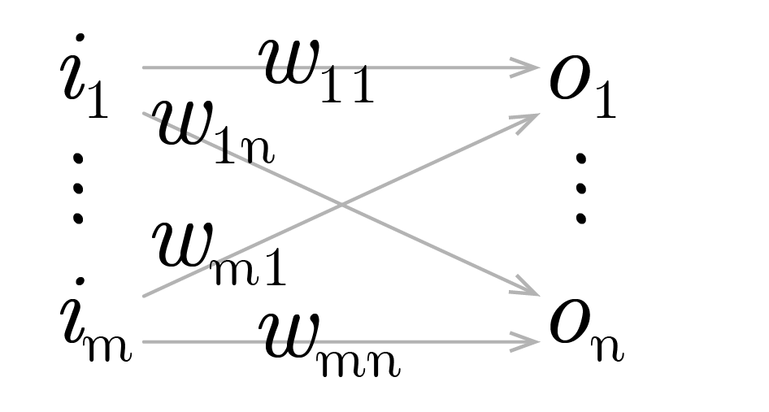{width=200px}

[Fonte: Elaboração própria]{custom-style="fonte"}

Onde:

$I_{1 \times m} := [i_1 \dots i_m]$ é um vetor de inputs à rede, e $T_{1 \times n} := [t_1 \dots t_n]$um vetor de alvos, de forma que para cada um dos ventores de input há um vetor de alvo correspondente, com a mesma dimensão da saída da camada;

$$ W_{m \times n} :=
\left[ \begin{matrix}
w_{11} & \dots & w_{1n} \\
\vdots & \ddots & \vdots \\
w_{m1} & \dots & w_{mn}
\end{matrix} \right] $$

é uma matriz representando os pesos das ligações entre os neurônios de entrada e saída, de forma que $w_{ij}$ seria o peso da ligação entre o iésimo neurônio de entrada e o jésimo neurônio de saída.

$A_{1 \times n} := [a_1 \dots a_n] \ |\
a_y := w_{1y}i_1 + \dots + w_{ny}i_n$ representa cada elemento da multiplicação entre o vetor de entrada e os pesos da camada, antes da aplicação, elemento à elemento, da função de ativação;

$O_{1 \times n} := [o_1 \dots o_n] \ |\
o_y := f(a_y) = f(w_{1y}i_1 + \dots + w_{ny}i_n)$ é um vetor representando as saídas finais da camada;

$E_{1 \times n} := [e_1 \dots e_n] \ |\
e_y := \varepsilon (o_y, t_y) =
\varepsilon (f(w_{1y}i_1 + \dots + w_{ny}i_n) , t_y)$ representa os erros individuais da rede para cada uma das saída motivadas por cada um dos inputs. Cabe notar que $\varepsilon (o_y, t_y) = (o_y - t_y)^2$ é a forma mais usual de computo dos erros individuais; define-se ainda o escalar $q := e_1 + \dots + e_n$ como a soma dos erros individuais para cada um dos vetores de erros.

De posse das definições acima, somos capazes de representar de forma compacta, em notação matricial, o movimento de predição (*forward pass*) de uma camada, como será visto. E, por extensão, de uma rede, na medida em que estas podem ser obtidas pela justaposição de um número arbitrários de camadas. O mesmo pensamento, de forma simétrica, presta-se à definição do movimento que atualizará os pesos (*backward pass*), e que é formalizado na próxima seção. Assim, derivaremos a seguir a forma básica do algoritmo de *backpropagation*.
Além de introduzir um referencial matemático para o algoritmo, isso permitirá que suas extensões, como Adam e Adagrad, utilizadas adiante, possam ser melhor compreendidas.

## Formalização de uma Rede Neural - Backpropagation

Tem-se que o gradiente do tensor de erros em relação a um peso arbitrário de uma camada pode ser escrito da forma FIXME:, com aplicação direta da regra da cadeia, e observando a seguinte notação para uma função qualquer $h(x)$ : $\frac{\partial}{\partial x}h(x) = h'(x)$.

$$
\frac{\partial q }{\partial w_{xy}} =
\varepsilon' (o_y, t_y) f'(a_y)i_x
\quad \text{Eq.:(I)}
$$

A matriz de incrementos para cada um dos pesos, a cada iteração, pode ser definida como abaixo, com a adição de uma taxa de aprendizado $\alpha$ com sinal negativo. Assim é, uma vez que o gradiente acima aponta para sentido de maior crescimento dos erros no espaço dos pesos: minimizar os erros implica, portanto, em mover os pesos em sentido oposto.

$$
\Delta W_{m \times n} :=
\left[ \begin{matrix}
\Delta w_{11} & \dots & \Delta w_{1n} \\
\vdots & \ddots & \vdots \\
\Delta w_{m1} & \dots & \Delta w_{mn}
\end{matrix} \right]  \ |\
\Delta w_{xy} := - \alpha \frac{\partial q}{\partial w_{xy}} = - \alpha \varepsilon' (o_y, t_y) f'(a_y)i_x
$$

Resta definir uma forma de propagar os erros às entradas da rede, permitindo assim que um número arbitrário de camadas sejam conectadas e treinadas. Para tanto, convém considerar uma camada anterior à rede em tela, com a forma e notação apresentadas em FIXME::

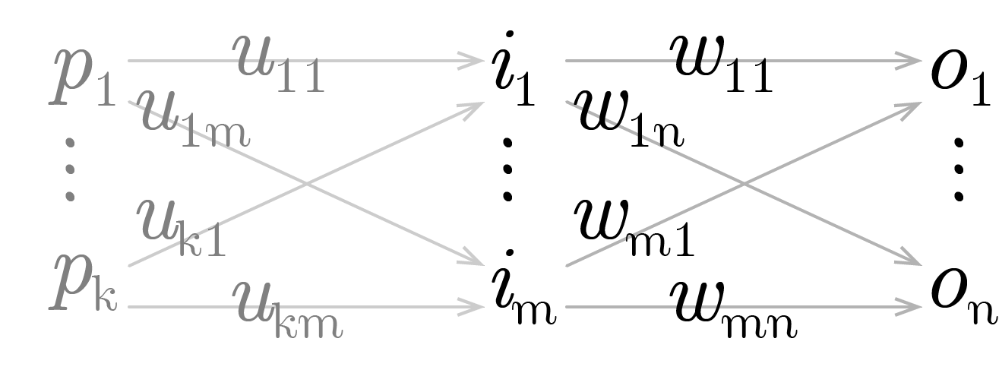{width=400px}

[Fonte: Elaboração própria]{custom-style="fonte"}

E, de forma análoga:

$$
\begin{align}
Z_{1 \times m} :=& [z_1 \dots z_m] \ |\
z_x := u_{1x}p_1 + \dots + u_{kx}p_k
\\
I_{1 \times m} =& [i_1 \dots i_m] \ |\
i_x := g(z_x) = g(u_{1x}p_1 + \dots + u_{kx}p_k)
\end{align}
$$

$$
\begin{align}
\frac{\partial q}{\partial u_{rx}} =&
[
\varepsilon' (o_1, t_1) f'(a_1) w_{x1} g'(z_x)p_r
+ \dots +
\varepsilon' (o_n, t_n) f'(a_n) w_{xn} g'(z_x)p_r
]
\\ =&
[
\varepsilon' (o_1, t_1) f'(a_1) w_{x1}
+ \dots +
\varepsilon' (o_n, t_n) f'(a_n) w_{xn}
] g'(z_x)p_r
\end{align}
$$

Comparando com $\text{I}$ é fácil observar que o somatório na primeira parte da última expressão corresponde a derivada do erro na primeira equação. Assim, Podemos definir o tensor do erro propagado da forma apresentada em FIXME::

$$
\begin{align}
E_{1 \times m}^b :=& [e_1^b \dots e_m^b] \ |\
e_x^b := \varepsilon' (o_1, t_1)f'(a_1)w_{x1}
+ \dots +
\varepsilon' (o_n, t_n) f'(a_n)w_{xn}
\end{align}
$$

Fixamos, dessa forma, todos os termos necessários à uma arquitetura modular: para camadas ocultas, para as quais não há como aferirmos diretamente o erro, o mesmo é propagado a partir das camadas posteriores.
Em forma vetorial, pode-se sintetizar o algoritmo como em FIXME:, observando a conveniência de introduzirmos o tensor $H_{1 \times n}$ para evitar redundância nos cálculos, e a notação $\odot$ denotando o produto de Hadamard (elemento a elemento) entre dois tensores:

$$
\begin{align}
O =& f(IW) \\
H_{1 \times n} :=& E \odot f'(A)\\
\Delta W =& -\alpha I^t H= - \alpha I^t (E \odot f'(A)) \\
E^b =& HW^t= (E \odot f'(A)) W^t
\end{align}
$$

# Metodologia

## Amostras Sonoras Utilizadas

Para a busca da coleção de amostras sonoras a serem utilizados para o treinamento da rede, algumas características são essenciais. Em primeiro lugar, uma licença permissiva, que não limite a utilização, modificação e posterior divulgação dos resultados obtidos deve ser explicitamente atribuída pelo autor. 

Além disso, para o caso da bateria, todas as peças de um *kit* ordinário devem estar presentes, e idealmente, organizadas de maneira inteligível, enquanto que para instrumentos temperados é bastante útil algum tipo de indicação da frequência fundamental de cada uma das amostras. 

É desejável também que, para cada peça, amostras representando várias dinâmicas tenham sido gravados, com especial atenção à intensidade com que cada peça é golpeada. Interessante ainda é a presença dos chamados *round-robins*: gravações redundantes de cada uma das amostras, que apresentam uma ideia de como fatores aleatórios influenciam no som produzido pelo instrumento.

Com isso em mente, procedeu-se à busca, em sites e blogs especializados, de indicações sobre trabalhos disponíveis que pudessem enquadrar-se nas condições citadas. No caso do *kit* de bateria, dois trabalhos em especial foram considerados:

O primeiro é um esforço de disponibilizar, através da plataforma *Github*, uma coleção livre de sons de bateria. O trabalho leva o nome de The Open Source Drumkit [@crabacus_2015] em consiste em uma coleção de amostras em formato .wav, separadas em pastas e nomeadas de acordo com a intensidade do golpe, e as peças específicas de um kit de bateria convencional, apresentando uma média de 10 articulações por peça.

O segundo é um esforço para a elaboração de um instrumento virtual de bateria denominado DrumGizmo [@drumgizmo], e apresenta samples gravadas a partir de 5 kits físicos de bateria. O número de articulações é bem maior, girando em torno de 20 por kit, e as gravações apresentam múltiplos microfones, com pelo menos um microfone por peça e são, em geral, de melhor qualidade. Além disso, a maioria dos *kits* adere à licença Creative Commons Attribution 4.0 International que permite o livre uso e adaptação do material disponibilizado em trabalhos derivados.

No caso das amostras de piano, em @ivy_audio pode ser encontrado, entre outros, um DMI baseado em samples de um Steinway Model B grand piano, com 5 dinâmicas e 2 *round-robins* para cada tecla, além de um total de 4 condições de microfonação. Detalhes dos termos de uso são discutidos na página de FAQ do site.

No site do University of Iowa Electronic Music Studios [@iowa] um conjunto bastante semelhante de amostras do mesmo piano pode ser encontrado, com a vantagem de uma atribuição mais livre de condições de uso; as amostras, no entanto, diretamente hospedadas no site, devem ser baixadas uma por vez.

Uma vasta gama de amostras sonoras de instrumentos clássicos, com variadas dinâmicas, é oferecida no site da Philharmonia Orchestra @philharmoniaorchestra.

## Redes Densas
É natural que a investigação tenha início com uma análise da arquitetura Feed-Forward, com redes compostas de um número arbitrário de camadas totalmente conectadas. Isso possibilita formar uma ideia de como essa arquitetura básica se comporta em um ambiente de alta dimensionalidade, pavimentando o caminho para a subsequente incorporação de novas arquiteturas e formulações na medida em que limites de aplicabilidade forem sendo encontrados.

Convém lembrar que o trabalho tem como foco a síntese sonora em tempo real, de forma que o tamanho, no sentido do número de neurons de uma rede neural, e sua complexidade, aspecto relacionado à arquitetura, tornam-se fatores potencialmente limitantes, e passam a requerer especial atenção. Redes convolucionais, por exemplo, devem ser tratadas com extrema cautela, por não possuírem um histórico de implementações eficientes.

Em primeiro lugar, procedeu-se ao tratamento dos samples: foram escolhidos, para esta investigação inicial, 5 tambores (os 4 tons disponíveis, e o bumbo esquerdo) do kit denominado Aasimonster disponibilizado pela iniciativa DrumGizmo, de cada um dos quais 20 dinâmicas foram escolhidas, gerando um total de 100 amostras, cada um com 16 canais (1 por microfone utilizado na gravação). 

foram extraídos os canais pertinentes à cada peça, resultando em 100 samples monofonicos em formato .wav, com *framerate* de 44100 frames por segundo. As dinâmicas para cada peça foram normalizadas em grupos de 4, de forma a emular 4 samples redundantes (*round-robins*) para 5 níveis diferentes de intensidade por peça. Cada uma das amostras foi truncada, para possuir exatamente um segundo de duração, e um efeito *fade-off* foi aplicado às amostras que estendiam-se além desse intervalo.

Esse conjunto de samples, de forma bastante direta, representou os alvos da rede neural, na forma de um vetor de dimensão 100 x 44100, como cada uma de suas linhas consistindo em uma representação digital da onda sonora de cada amostra. A conversão foi efetuada utilizando o módulo Pywave da linguagem Python, e cada vetor foi normalizado no espaço [-1,1]. Os samples foram renomeados de forma a serem mais descritivos.

Exemplificando, temos que a amostra de rótulo 154, corresponde à quarta amostra redundante referente à primeira peça (o tom mais agudo), golpeada com intensidade 5 (maior intensidade). Assim, as amostras 321, 322, 323 e 324, por exemplo, correspondem à quatro variações do mesmo evento: cada um deles representa a terceira peça golpeada com intensidade 2. Os dados de entrada da simplesmente refletem essa nomenclatura em um intervalo [0,1] e são apresentados na table FIXME:.

| Peça  | Peça Norm. | Intensidade | Intensidade Norm. | Sample # | Sample # Norm. |
| ----- | ---------- | ----------- | ----------------- | -------- | -------------- |
| 1     | 0.00       | 1           | 0.00              | 1        | 0.00           |
| 2     | 0.25       | 2           | 0.25              | 2        | 0.33           |
| 3     | 0.50       | 3           | 0.50              | 3        | 0.66           |
| 4     | 0.75       | 4           | 0.75              | 4        | 1.00           |
| 5     | 1.00       | 5           | 1.00              | -        | -              |
:Nomenclatura utilizada

[Fonte: Elaboração própria]{custom-style="fonte"}

O que pretende-se é forçar uma associação de cada uma das características da onda à cada uma das 3 dimensões do vetor de entrada. Esse rationale tem algumas implicações importantes: critérios de validação, embora possíveis de construir, perdem bastante do seu significado e foram deixados de lado em favor de um julgamento subjetivo da qualidade das amostras geradas.

### Algoritmos de Otimização

Utilizando as 100 amostras, processados como descrito, como alvos, e seus rótulos normalizados como entradas, buscou-se investigar os hiperparâmetros de uma rede neural densa mais adequados ao apredizado e reprodução das ondas; essa é uma etapa importante, pois vários parametros aqui definidos serão assumidos como ótimos e utilizados em etapas posteriores, em arquiteturas diferentes.

Essa necessidade tem origem nas restrições de tempo e poder computacional, que impedem a realização de novos testes dessa magnitude para cada uma das arquiteturas futuramente investigadas. A plataforma escolhida para a implementação das redes foi o Keras, rodando com o Tensorflow como *backend*. Essa escolha permite aproveitar a velocidade de experimentação conferida pela arquitetura em nível mais alto da biblioteca Keras sem comprometer muito a flexibilidade.

Em primeiro lugar, é conveniente investigar o melhor algoritmo de atualização dos pesos: embora, conceitualmente, mesmo a versão pura da descida em gradiente, utilizando uma taxa de aprendizado adequada, leve à eventual convergência da rede [@ruder2016overview], na prática a velocidade dessa convergência varia consideravelmente dependendo do método utilizado, e um algoritmo eficiente permite a realização de mais testes no mesmo intervalo de tempo.

A literatura disponível, embora esclarecedora, não é unanime ao apontar uma técnica universalmente superior às outras, de forma que uma investigação empírica faz-se necessária, e é descrita a seguir.

testou-se, em uma rede com uma camada oculta composta por 100 neurons, em lotes (*batches*) de 100 vetores de entrada e durante 500 épocas os seguintes algoritmos de otimização: SGD com uma *learning rate* de 0,01, o algoritmo experimental RMSProp [@tieleman2012lecture], os otimizadores Adam [@kingma2014adam] [@reddi2018convergence], Adagrad [@duchi2011adaptive], Adadelta [@zeiler2012adadelta], Adamax[@kingma2014adam] e Nadam [@dozat2016incorporating] [@sutskever2013importance]. A função de ativação utilizada em todas as camadas foi a tangente hiperbólica, e a função de perda foi a média dos quadrados dos erros. Foi tomado cuidado para que todos os testes iniciassem em condições pseudo-randomicas idênticas.

SGD e Adadelta ofereceram resultados bastante semelhantes, e aquém dos outros. Todos os outros convergiram de forma semelhante, sendo o Adagrad o mais rápido de todos, e Nadam o mais eficaz na diminuição da função de perda.

A comparação por tempo relativo, disponível a partir do Tensorboard, permite visualizar a superioridade do algoritmo Nadam: com 2,57 minutos de treino, o tempo em que o treinamento foi concluído com o algoritmo Adagrad, ele proporcionou o menor valor da função objetivo.

Convém investigar, dessa forma, o comportamento da rede treinada com ambos os algoritmos, já que o parâmetro mais importante é a rapidez com que a rede alcança um nível de erro capaz de gerar samples com qualidade satisfatória. Após essa comparação exploratória, mais profunda, poderemos identificar tanto o valor limite da função de perda, quanto o tempo em que a rede mais eficiente leva para alcançá-lo, utilizando essas informações como parâmetros para investigações posteriores, inclusive de outras arquiteturas.

### *Grid search* para topologia e parâmetros
Fixado os potenciais algoritmos de otimização, procedeu-se a um *grid search*, para investigar o número de camadas ocultas, respectivos neurons e o efeitos dos tamanhos dos *batchs* , tanto em relação ao impacto no tempo total de treinamento quanto à rapidez (e limite) de convergência.

#### Adagrad
Testou-se _batches_ de 1, 10, 50, 100, 150 e 200 samples para redes com 25, 50, 75 e 100 neurônios em cada camada oculta, em um intervalo de 0 a 3 camadas ocultas, gerando um total de 82 redes distintas, que foram treinadas durantes 500 épocas.

Para uma rede sem camadas ocultas, um *batch* igual a 1 foi o mais efetivo, em 500 épocas, porém o mais lento. _batches_ de 100 e 50 foram os mais rápidos. O impacto no valor final da perda, no entanto, foi desprezível para todos os tamanhos de _batches_.
para um camada oculta com 25 neurons, _batches_ de 100 e 150 neurons ofereceram resultados idênticos, sendo os mais rápidos e mais eficientes.

A partir desse ponto, _batches_ de 100, 150 e 200 começaram a apresentar comportamentos semelhantes.
Cabe notar que _batches_ unitários parecem piorar muito o tempo de execução na medida em que o número de neurônios aumenta.
temos abaixo os melhores resultados por *batch* e seus respectivos tempos. Todos eles encontram-se nas redes com 3 camadas ocultas.

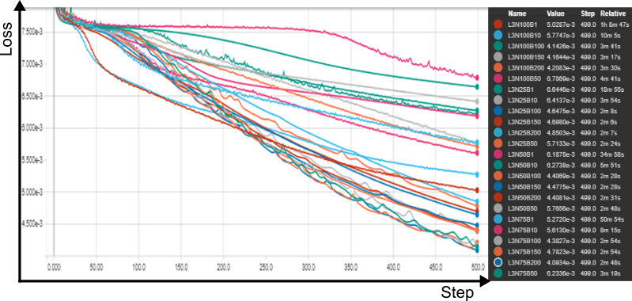

[Fonte: Elaboração própria]{custom-style="fonte"}

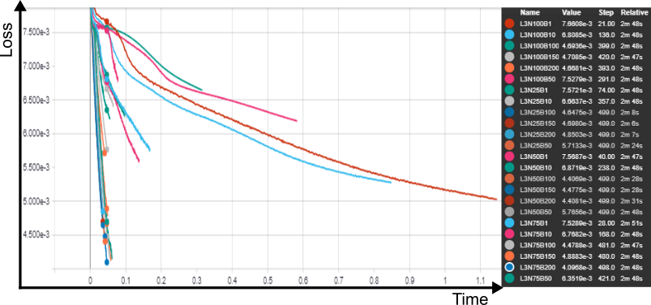

[Fonte: Elaboração própria]{custom-style="fonte"}

| Batches | neurônios por camada oculta | Loss (e-3) | tempo |
| ------- | --------- | ---------- | ------ |
| 200     | 75        | 4,0934     | 2m 48s |
| 100     | 100       | 4,1426     | 3m 41s |
| 150     | 100       | 4,1644     | 3m 17s |
| 1       | 50        | 4,4069     | 2m 28s |
| 10      | 75        | 5,6130     | 8m 15s |
| 50      | 25        | 5,7133     | 2m 24s |
:Menores valores da perda após 500 iterações

[Fonte: Elaboração própria]{custom-style="fonte"}

Nesse ponto fica evidente que uma arquitetura formada por 3 camadas ocultas de 75 neurons é suficiente para aprender a uma representação direta das ondas, e a mais eficiente sob o otimizador Adagrad. O gráfico da função de perda em função do tempo de treinamento torna essa visualização mais fácil.

#### Nadam
Para essa etapa _batches_ de 10, 50 e 100 amostras sonoras foram utilizados; dispensou-se _batches_ unitários, pelo comportamento ineficiente identificado, e os _batches_ acima de 100, já que não introduziram melhorias significativas. Foram testadas, para cada um desses _batches_, redes com todas as combinações entre 25, 50, 75 e 100 neurons, até o limite de 3 camadas ocultas. Os resultados são apresentados abaixo, para as arquiteturas com 3 camadas.

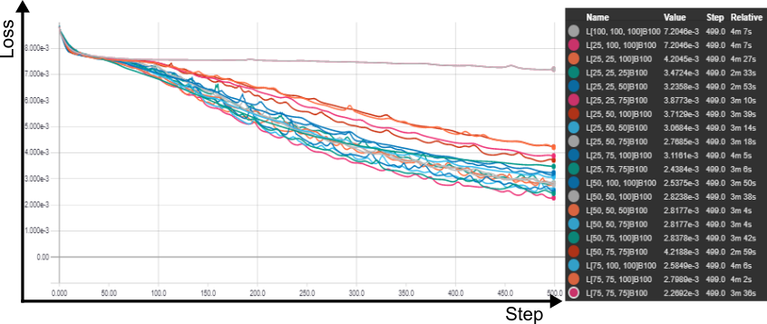{width=800px}

[Fonte: Elaboração própria]{custom-style="fonte"}

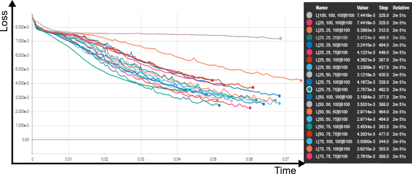{width=800px}

[Fonte: Elaboração própria]{custom-style="fonte"}

| Batches | neurônios por camada oculta | Loss (e-3) | tempo    |
| ------- | --------------------------- | ---------- | -------- |
| 10      | 75 100 100                  | 0.44632    | 16m 59 s |
| 10      | 50 50 100                   | 1.5559     | 15m      |
| 100     | 25 75 75                    | 2,4384     | 3m 6 s   |
| 50      | 75 75 75                    | 2.2692     | 3m 36 s  |
| 100     | 75 75 75                    | 2.2692     | 3m 38 s  |
| 50      | 75 100                      | 4.9025     | 5m 4s    |
:Menores valores da perda após 500 iterações

[Fonte: Elaboração própria]{custom-style="fonte"}

Uma rede feedforward com 3 camadas de 75 neurons parece oferecer a arquitetura ideal, com ambos os otimizadores. Esses hisperparametros servirão da base para arquiteturas futuras desenvolvidas neste trabalho.

#### Ativações e Otimizadores

A performance dos dois, para 2000 *steps*, é comparada abaixo; também é comparado o impacto da função de ativação softsign, em relação à tanh utilizada até agora.

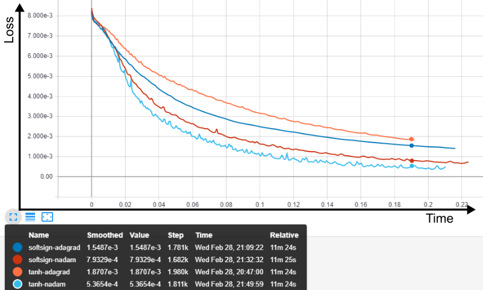

[Fonte: Elaboração própria]{custom-style="fonte"}

Podemos ver que a combinação do otimizador Nadam com a função de ativação tanh é a mais eficiente.

### Análise dos resultados
Os testes acima proporcionam uma visão objetiva sobre o comportamento geral da arquitetura densa na resolução do problema em tela. Faz-se necessário, contudo, uma análise das amostras de som geradas pelas redes investigadas, de forma a entender, do ponto de vista sensorial, sua verossimilhança, além da capacidade de generalização da rede.

Tomando como métrica a o valor da função de perda ao final do treinamento, podemos selecionar algumas redes para investigar seu comportamento.

Analisando a rede com maior valor de função de perda após o treinamento (a rede sem camadas ocultas treinada com Adagrad em *batches* de 100), a rede escolhida como baseline (75 neurons em cada uma de 3 camadas ocultas, otimizador Nadam, batches de 100) e a rede com a menor perda após o treinamento (a rede com 75, 100 e 100 neurons em suas camadas ocultas, treinada com Nadam em *batches* de 10), desenvolveremos alguma intuição acerca da relação entre a função de perda e a verossimilhança das amostras produzidas. Os dados são sintetizados na tabela FIXME:

| N°  | Camadas    | Batch | Otimizador  | Valor final da função de perda     |Parametros|
| --- | ---------- | ----- | ----------- | ---------------------------------- |----------|
| 01  | 75 100 100 | 10    | Nadam       | 4.4632 E-4                         | 4,472,100|
| 02  | 75 75 75   | 100   | Nadam       | 2.2692 E-3                         | 3,363,300|
| 03  | 0          | 100   | Adagrad     | 7.6421 E-3                         |   176,400|
:Redes para análise das amostras sonoras

[Fonte: Elaboração própria]{custom-style="fonte"}

O formato das ondas das amostras da primeira peça da bateria, segundos _round-robins_, são mostrados na coluna à esquerda da figura FIXME:, enquanto que as outras colunas mostram os resultados das redes. As amostras podem ser ouvidas no repositório preparado para o trabalho [tarjano_2018], no caminho ["resources/01_wavs_FF/"](https://github.com/tesserato/tesserato.github.io/tree/master/resources/01_wavs_FF).

<table>
  <tr>
    <th>Amostra</th>
    <th>Rede 1</th>
    <th>Rede 2</th>
    <th>Rede 3</th>
    <th>Alvo</th>
  </tr>
  <tr>
    <th>0.0</th>
    <th>
      <audio controls preload> 
        <source src="resources\01_wavs_FF\alvos\0.wav"></source>
      </audio>
    </th>
    <th>
      <audio controls preload> 
        <source src="resources\01_wavs_FF\rede01\0.wav"></source>
      </audio>
    </th>
    <th>
      <audio controls preload> 
        <source src="resources\01_wavs_FF\rede02\0.wav"></source>
      </audio>
    </th>
    <th>
      <audio controls preload> 
        <source src="resources\01_wavs_FF\rede03\0.wav"></source>
      </audio>
    </th>
  </tr>
  <tr>
    <th>1.0</th>
    <th>
      <audio controls preload> 
        <source src="resources\01_wavs_FF\alvos\1.wav"></source>
      </audio>
    </th>
    <th>
      <audio controls preload> 
        <source src="resources\01_wavs_FF\rede01\1.wav"></source>
      </audio>
    </th>
    <th>
      <audio controls preload> 
        <source src="resources\01_wavs_FF\rede02\1.wav"></source>
      </audio>
    </th>
    <th>
      <audio controls preload> 
        <source src="resources\01_wavs_FF\rede03\1.wav"></source>
      </audio>
    </th>
  </tr>
</table>

Nas linhas da figura FIXME: em que não há um alvo, os resultados foram extrapolados pelas redes. A primeira rede apresenta um balanço razoável entre acurácia e poder de generalização, enquanto a segunda, com um número um pouco menor de parametros, introduz uma quantidade considerável de ruído ao fim das amostras. A terceira, consideravelmente menor, parece ter aprendido uma representação intermediária entre os exemplos, que varia apenas ligeiramente de peça para peça.

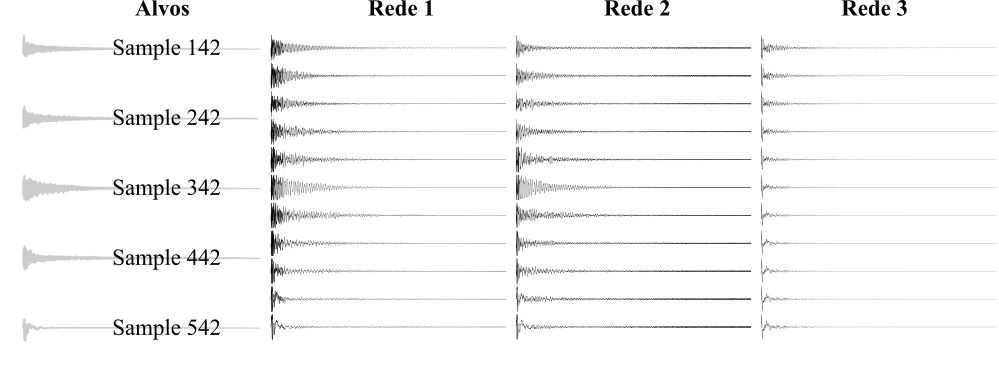

[Fonte: Elaboração própria]{custom-style="fonte"}

Cabe observar que a primeira rede, com pouco mais de 4 milhões de parâmetros, ocupa-se de cobrir uma família de peças da bateria, e ocupa em disco aproximadamente 50 MB, implicando que um conjunto completo de redes girará em torno de 200MB, na medida em que uma rede ocupe-se dos tambores (incluindo o bumbo), como foi o caso, uma outra da caixa, um terceira do contratempo, e uma quarta para os pratos. Embora o tamanho seja razoável, sobretudo à luz dos DMIs comerciais de ponta, como o Superior Drummer 3 da empresa Toontrack, com 230GB, estratégias podem ser utilizadas para aumentar a eficiência da rede.

Isso torna-se especialmente importante se lembrarmos que limitamos a duração das amostras ao tempo de 1 segundo. Para os tambores, caixa e a maior parte das articulações do contratempo, essa duração é razoável. Os pratos, contudo, principalmente quando alvos de um ataque mais forte, costumam apresentar um tempo de decaimento de aproximadamente 10 segundos, o que demandaria uma rede no mínimo 10 vezes maior.

Em outras palavras, essa arquitetura não se presta à generalização da duração de uma onda sonora, impondo um limite à duração máxima que poderá ser gerada, e é inaplicável, ao menos de uma modo direto, à emulação de instrumentos que possuem o som sustentado pela injeção constante de energia da parte do instrumentista, como é o caso dos metais, como trombone, saxofone, etc, e instrumentos da família do violino, onde, respectivamente, o sopro e o arco injetam constantemente energia no sistema, e o som pode ser mantido por estendidos períodos de tempo.

## Redes Recorrentes

Os resultados obtidos com a utilização de redes densas encorajam a investigação do comportamento de redes recorrentes, já que possuem o potencial de diminuir o número de parâmetros, apresentando ainda a possibilidade de generalização do tempo de duração dos sons gerados. Um escolha sensível é dividir os alvos em intervalos de 4410 samples, o que equivale a intervalos de 0.1 segundo para o _sampling rate_ de 44100 FPS dos arquivos utilizados, o que equivale aproximadamente à 5 vezes a resolução temporal mínima do ouvido humano [@zwicker2013psychoacoustics]. Após alguns testes, a arquitetura recorrente apresentada na figura abaixo foi escolhida.

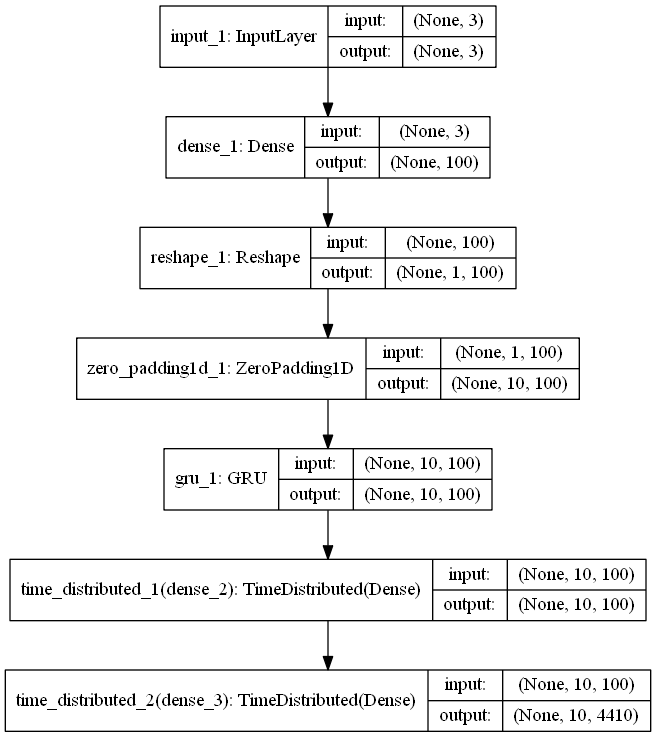{width=400px}

[Fonte: Elaboração própria]{custom-style="fonte"}

Com 516 210 parametros treináveis (contra 4 472 100 da rede densa), essa topologia gera resultados semelhantes aos da rede totalmente conectada, tanto em relação à função de perda quanto à capacidade de generalização, além de possuir um tamanho em disco aproximadamente 10 vezes menor. A figura FIXME: ilustra as ondas geradas correspondendo às amostras 454 e 554, e a generalização da rede para uma amostra entre essas duas, correspondente à um tom entre o tom mais grave e o bumbo. Esse intervalo foi escolhido justamente por apresentar a maior disparidade, tanto sonora quanto visual, entre as ondas.

[Fonte: Elaboração própria]{custom-style="fonte"}

Os testes psicoacústicos revelam, porém, que as pequenas descontinuidades entre duas previsões subsequentes (não visíveis na figura acima) traduzem-se em um som de batidas, o que compromete a qualidade do som gerado pela rede.

## Redes Convolucionais e Convolucionais-Recorrentes

Uma estratégia adotada para contornar o problema, inspirada no funcionamento das redes convolucionais, foi adotar uma interseção entre previsões subsequentes da rede; essa região seria ao fim multiplicada por uma função _smoothstep_ decrescente, da forma $1 - (3x^2 - 2x^3)$, definida no intervalo entre 0 e 1, a fim de equacionar de forma suave as constribuições dos dois passos da rede, sem introduzir novas descontinuidades. A arquitetura proposta é ilustrada abaixo, e de fato é bastante eficaz em eliminar as descontinuidades diretas entre as previsões.

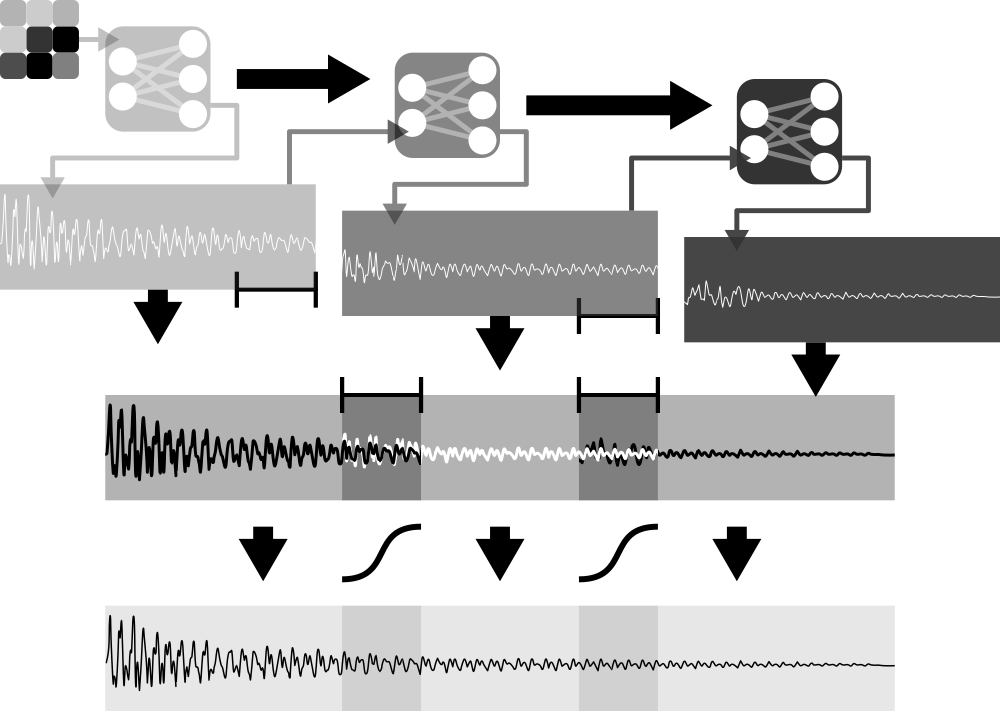

[Fonte: Elaboração própria]{custom-style="fonte"}

Os quadrados na região superior esquerda da figura representam os vetores de entrada iniciais fornecidos no primeiro passo. Nos passos subsequentes, a rede recebe seus próprios vetores de saída, e a partir deles gera a fração seguinte da onda, de forma recursiva, em uma configuração denominada _one-to-many_ (na prática, como pode ser observado no código do programa disponibilizado no repositório [tesserato_2018], encontrando no caminho [resources/02_RNN.py](https://github.com/tesserato/tesserato.github.io/blob/master/resources/02_RNN.py), as entradas recebem o vetor de entrada em cada passo, ou um vetor nulo a partir do segundo passo, por limitações técnicas. Após algumas épocas, no entanto, a rede aprende a ignorar essas entradas adicionais).

Todas as frações de onda geradas, com exceção da última, possuem uma interseção com o início da fração seguinte, e a influência de cada uma das previsões no resultado final dá-se a partir dos pesos retirados da função _smoothstep_: O primeiro ponto da região de interseção é determinado, portanto, inteiramente pela previsão mais antiga enquanto o último o é totalmente pela previsão mais recente. A influência majoritária nos pontos internos passa gradativamente, de maneira suave, da previsão mais antiga para a mais nova.

Contudo, nos resultados alisados persiste ainda um problema relacionado, principalmente, ao transiente no meio onde propaga-se a perturbação, uma etapa bastante mal comportada que ocorre logo após o impulso inicial ser aplicada à corda, membrana ou prato e durante a qual o regime (quasi) periódico não foi ainda alcançado. Isso resulta, do ponto de vista da onda, em uma etapa curta, que pode ser vista no início da figura FIXME:, e que apresenta vibrações aberrantes em frequências diferentes e maiores do que frequência fundamental do sistema.

Essas frequências são capturadas pela rede recorrente, e equivocadamente aplicadas ao início de cada um dos seus passos (e não só ao primeiro). A figura FIXME:, um detalhe aumentado da onda correspondente à amostra 111, onde é capturada a fronteira entre duas previsões subsequentes, ilustra esse efeito na coluna da direita, enquanto as descontinuidades não tratadas podem ser vistas na coluna da esquerda. 

As consequências sonoras podem ser ouvido no caminho ["resources/02_wavs_RNN/"](https://github.com/tesserato/tesserato.github.io/tree/master/resources/02_wavs_RNN) do repositório preparado para o trabalho [@tesserato_2018], nos dois arquivos .wav que possuem o prefixo "beating" e refletem-se em batidas, mais acentuadas no caso das ondas sem o tratamento.

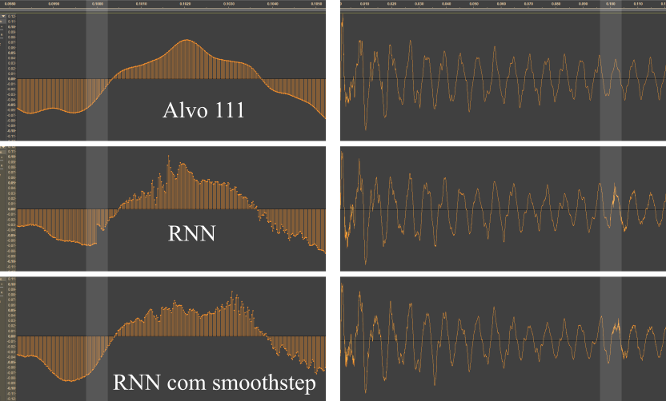

[Fonte: Elaboração própria]{custom-style="fonte"}

O problema é tratável, e um dos encaminhamentos possíveis, tomando como inspiração o algoritmo dos _banded digital waveguides_ [@serafin2001banded] é distribuir o esforço de previsão entre mais de uma rede, por exemplo, ocupando cada uma de prever uma faixa de frequências. Observou-se, no caso dos samples utilizados até agora, que aproximadamente 4 faixas seriam necessárias, refletindo-se em 4 redes por família de peças, em um total de 16 redes. As exatas fronteiras entre as faixas dependem tanto da arquitetura quanto das características do instrumento a ser emulado e requerem uma investigação empírica bastante extensa que deixou de ser desenvolvida neste trabalho, por limitações de tempo.

Uma outra abordagem seria reservar à uma rede densa a previsão dos transientes, deixando sob responsabilidade de uma rede recorrente o período estacionário, mais bem comportado. É ainda possível uma abordagem experimental em que ao mecanismo de memória da rede sejam adicionados mecanismos que façam as vezes de filtros digitais _low-pass_, que tem como resultado amenizar as frequências mais altas das ondas.

## Autoencoders 
TODO:

## Domínio da Frequência

Podemos tirar proveito do caráter periódico dos samples e representá-las diretamente no domínio da frequência. Utilizando a transformada de Fourier, como visto, temos à disposição uma forma de representar perfeitamente a onda utilizando um vetor de números complexos com metade da dimensão da onda original, explorando o fato de que estamos nos restringindo a representações temporais no domínio dos números reais.

A princípio, tal transformação de domínio não introduziria uma forma mais compacta de representação das ondas, do ponto de vista computacional, haja vista que números complexos são representados por pares de números reais. Levando em conta, contudo, que o ouvido humano não é capaz de perceber frequências fora da faixa entre 20 Hz e 20 KHz [@howard2017acoustics], identificamos uma das vantagens de trabalharmos no domínio das frequências: podemos truncar o resultado da FFT à este intervalo (tomando o cuidado de traduzi-lo em termos das frequências locais da transformada).

Além disso, trata-se de uma representação independente do tempo de duração da onda representada, o que no permite trabalhar com uma arquitetura densa prevendo ondas de tamanhos variados. Mais a frente, serão ilustradas outras vantagens dessa abordagem, levando em conta características físicas do instrumento a ser emulado e propriedades da transformada.

A imagem a seguir compara a distribuição de frequências do som gerado por um prato de bateria e o som gerado pela Dó central de um piano (tecla 49 em um piano padrão), e ajuda a entender a diferença entre os dois instrumentos, e como, mais adiante, poderemos explorar o carater bem comportado dos sons produzidos por intrumentos harmonicos.

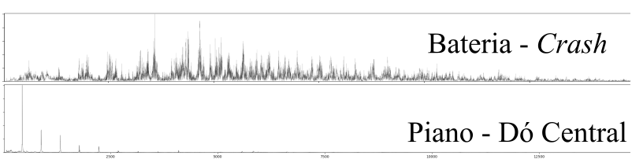

[Fonte: Elaboração própria]{custom-style="fonte"}

Para a emulação de um _kit_ completo de bateria 4 redes foram treinadas; as amostras sonoras foram divididas de acordo com as afinidades de diferentes conjuntos de peças e levando em conta também o grau de expressividade demandado. As amostras utilizadas no treinamento, divididas em suas respectivas pastas, podem ser acessadas no repositório do trabalho [@tesserato_2018] no caminho ["resources/samples/"](https://github.com/tesserato/tesserato.github.io/tree/master/resources/samples). De maneira semelhante, a implementação da rede está disponível no endereço ["resources/02_RNN.py"](https://github.com/tesserato/tesserato.github.io/blob/master/resources/02_RNN.py).

Somente para a caixa e tons foram utilizados *round-robins*, devido à alta propensão ao efeito *machine-gun* quando as peças são utilizadas em rápida sucessão, articulação comum em vários estilos musicais.

A arquitetura utilizada é como apresentada na figura FIXME: e é uniforme para todas as peças; variações no número de parâmetros ocorrem em função da diferença de duração das ondas no caso dos pratos. Para o caso da caixa, contratempo e dos tambores, incluído o bumbo, cada uma das redes é compostapor 120 008 parâmetros treináveis, incluindo pesos das conexões e biases, com um tamanho em disco de aproximadamente 1,4 Mb.

Os pratos, por possuírem um som com maior tempo de sustentação, demandaram uma rede com saídas maiores, totalizando 360 008 parametros treináveis e quase o triplo do tamanho em disco. Temos assim que todo o sistema possui em torno de 9 Mb de tamanho em disco. Foram utilizadas funções de ativação lineares, tanto para evitar _overfitting_ quanto para permitir uma implementação menos intensiva, do ponto de vista computacional.

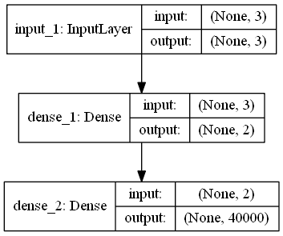{width=400px}

[Fonte: Elaboração própria]{custom-style="fonte"}

Os resultados são bastante satisfatórios, tanto em termos de acurácia quanto de generalização. A rede não decora nenhuma das distribuições, como é esperado, mas aprende a generaliza-las no espaço bidimensional que tem como eixos o tipo da peça, que reflete a grosso modo uma variação entre agudo e grave e a intensidade da batida. A figura FIXME: ilustra uma onda onde foram concatenadas as saídas da rede para o contratempo aberto, golpeado com intensidade crescente. A onda concatenada pode ser ouvida no caminho ["resources/04_freq_domain/Exemplos das Predições - Bateria/contratempo_piano_para_forte.wav"]() do repositório do trabalho, enquanto as amostras originais encontram-se em ["resources/04_freq_domain/Exemplos das Predições - Bateria/Intensidade - Contratempo Aberto]()

<audio controls preload> 
<source src="resources/04_freq_domain/Exemplos das Predições - Bateria/contratempo_piano_para_forte.wav"></source>
</audio>

[Fonte: Elaboração própria]{custom-style="fonte"}

No casa das redes treinadas com o uso de _round-robins_ pode-se imaginar um terceiro eixo no qual a rede generaliza variações percebidas nas amostras utilizados para o treinamento. A rigor, o efeito é determinístico, totalmente dependente dos inputs da rede. Pode-se pensar nele, contudo, como um termo que adiciona certa aleatoriedade aos sons gerados, na medida em que pode-se alimentar a rede com um número arbitrário entre -1 e 1 para para cada amostra gerada, introduzindo variações que emulam a aleatoriedade natural do instrumento. Essas variações são ilustradas na fig FIXME:, para o caso do tom mais agudo. As ondas geradas pela rede podem ser encontradas em ["resources/04_freq_domain/Exemplos das Predições - Bateria/Round-Robins - Tom 01"]() e a versão concatenada, exibida em FIXME:, para maior comodidade, encontra-se em ["resources/04_freq_domain/Exemplos das Predições - Bateria/tom_roundrobins.wav"]()

<audio controls preload> 
<source src="resources/04_freq_domain/Exemplos das Predições - Bateria/tom_roundrobins.wav"></source>
</audio>

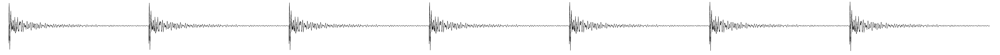

[Fonte: Elaboração própria]{custom-style="fonte"}

Um efeito colateral desse comportamento geral da rede é que ela não reproduz exatamente nenhuma das amostras utilizados no treinamento, e não há garantias do grau de semelhança entre os timbres gerados e os exemplos utilizados. Empiricamente, no entanto, observou-se que as características do espectro de frequências aprendidas e generalizadas pela rede imprimem ao resultado um timbre totalmente verossímil; em outras palavras, os tons soam como tons, não exatamente com o mesmo timbre que cada uma das peças utilizadas no treinamento, mas como uma amalgama entre elas. Assim é com os pratos, e sucessivamente para todas as peças.

Quando o esforço é o de emular duas dinâmicas diferentes de uma mesma peça, como é o caso da caixa, em que uma das variáveis é, como para todas as outras peças, a intensidade, e a outra é a centralidade da batida (mais próxima ou afastada do centro da caixa), observa-se resultados ainda mais orgânicos, como pode ser visto em FIXME:. As ondas geradas podem ser ouvidas em ["resources/04_freq_domain/Exemplos das Predições - Bateria/Centralidade - Caixa/"](), enquanto que a versão concatenada, como paresentada na figura FIXME: está disponível em ["resources/04_freq_domain/Exemplos das Predições - Bateria/caixa_centro_para_bordas.wav"]().

<audio controls preload> 
<source src="resources/04_freq_domain/Exemplos das Predições - Bateria/caixa_centro_para_bordas.wav"></source>
</audio>

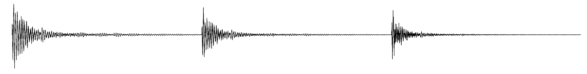

[Fonte: Elaboração própria]{custom-style="fonte"}

Para sons com características harmonicas, de frequências definidas, esse método não oferece bons resultados, na medida em que incorpora as características gerais de cada um dos sons utilizados no treinamento. É curioso observar que, por exemplo, treinando a rede para aprender a interjeição 'ah' cantada em diferentes notas, o resultado tem uma qualidade parecida com um coral. 

As transformadas são exibidas abaixo, tanto dos sons originais quanto das previsões, para a nota mais baixa e mais alta. É possível reparar que a previsão encaminha-se para os picos em ambos os casos, mas incorporando uma grande quantidade de dados indesejáveis.

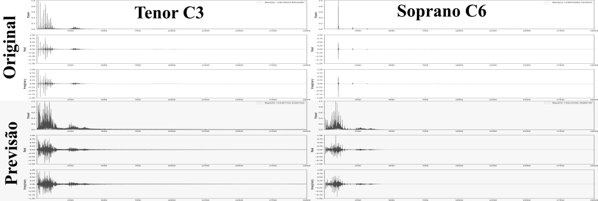

[Fonte: Elaboração própria]{custom-style="fonte"}

Dessa forma, para a simulação de intrumentos de caráter harmonico, o método apresentado na seção FIXME: foi desenvolvido.

## Modelo Misto

Pudemos notar que instrumentos de caráter harmonico possuem um distribuição de frequências bem comportada, consistindo basicamente de alguns picos em sua representação no domínio da frequência. Ademais, para que seu som seja considerado harmonioso, esses picos distribuem-se de forma ordenada; idealmente, são múltiplos inteiros da frequência fundamental da nota reproduzida. É importante notar que o largura da 'base' desses padrões de picos é proporcional ao decaimento de uma senoide pura: no caso extremo, uma senoide perfeitamente periódica possui uma distribuição de frequências zero em todos os pontos, com excessão da sua frequência. A figura a seguir ilustra essa relação.

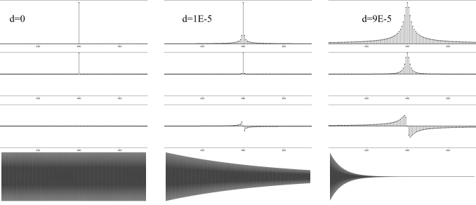

Podemos observar também que o decaimento introduz novas frequências, ao redor da frequência principal, e mudanças de fase na representação no domínio da frequência; observa-se empiricamente que o 'objetivo' primordial dessas novas frequencias e fases é reproduzir o efeito de decaimento (ou, de forma mais ampla, o envelope) da onda.
Dessa observação, duas intuições importantes podem ser retiradas: A primeira é que, com um grau razoavel de aproximação, podemos descrever um som hamonico gerado por uma excitação impulsiva em função da localização de algumas de suas frequências, suas respectivas intensidades e os seus decaimentos.
É natural supor também que a influência das fases dessas ondas pode ser ignorada, o que compra-se empiricamente a partir da resconstrução de ondas com as fases originais e fases nulas ou aleatórias.

De posse disso podemos, então, descartar as informações sobre a fase específica de cada parcial da onda. Esse fenomeno é construtivo (TODO:), de forma que a interposição de ondas não o afeta.

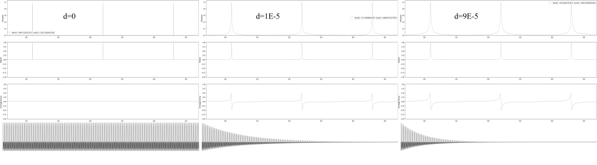

Resta, então, desenvolver um *framework* para extração das frequências principais de uma onda sonora, suas respectivas almplitudes e seus envelopes, que aqui assumiremos, simplificadamente, da forma exponencial. Se lembrarmos que a transformada de Fourier oferece a intensidade de cada uma das frequências que compõe a onda (ou mesmo a amplitude, se normalizada de forma adequada) pode-se supor que o levantamento das duas primeiras informações sobre a onda torna-se trivial. Algumas dificuldades, contudo, logo apresentam-se: elencando as frequencias de maior intensidade de uma onda arbitrária, rapidamente notamos que muitas delas fazem parte de um mesmo pico. Além disso, as amplitudes referidas na transformada são as amplitudes médias da frequência em toda a onda que, além de não serem diretamente utilizáveis, não oferecem informação sobre o comportamento delas no tempo.

### Frequências
Atacando a questão das frequências, é conveniente lembrar de que, em uma onda pefeitamente harmonica, temos uma frequência fundamental $f_0$, da qual todas as outras frequências relevantes são múltiplos inteiros, da forma $f_n = n f_0, n \in \mathbb{Z}^+$. Além disso, a frequência fundamental é, geralmente, a de maior intensidade (mas nem sempre, como ilustrado abaixo). Podemos fazer uso desta informação para encontrar os picos em uma onda. No caso das teclas de um piano, a relação entre as 88 teclas e sua frequência fundamental pode ser encontrada a priori a partir da fórmula $f_0 = (tecla^2 - 49) / 12 * 440$.
Podemos, então, buscar os máximos nos intervalos apropriados. A figura a seguir compara esse algoritmo com o simples levantamento dos maiores valores de intensidade, para uma onda correspondete ao som emitido pela tecla 35 de um piano, da qual busca-se os 30 primeiros picos, correspondendo às 30 primeiras frequências parciais.

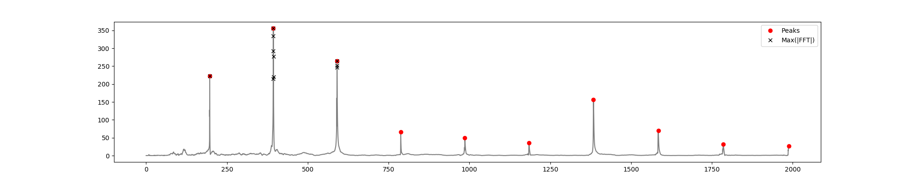

Repara-se que simplesmente elencando os maiores valores, todas as frequências identificadas gravitam em torno as 3 primeiras parciais. Com o algoritmo de busca de picos, as verdadeiras parciais da onda são capturadas, em intervalos bastante próximos à multiplos inteiros de $f_0$. É interessante observar que a onda ilustrada representa um caso onde a frequência fundamental não corresponde a elevação mais alta.

### Decaimentos e Amplitudes
Uma abordagem possível para a investigação das frequências parciais identificadas seria a aplicação de um método iterativo, seja a partir de um algoritmo de *curve fitting*, seja com a utilização de redes neurais. Ambos os métodos foram investigados e limitações críticas foram identificadas: O algoritmo iterativo usado para *curve fitting* não apresenta garantias de convergência. Além disso, o processo iterativo deve ser utilizado para cada uma das ondas, e para cada uma das frequências parciais que deseja-se extrair de cada uma delas. Mesmo tratando-se de uma etapa prévia, que não fará parte do modelo em tempo real, os custos computacionais mostraram-se proibitivos (sobretudo para ondas com vários segundos de duração). De maneira semelhante, o método baseado em redes neurais, embora não deixe de convergir, não apresenta garantias sobre a qualidade dos resultados. Além disso, os dois algoritmos são míopes, no sentido de que, na busca por minimizar suas funções objetivo, geram por vezes senoides com aplitudes e decaimentos aberrantes.

Considerando, de forma aproximada, que todos os decaimentos são exponenciais, é possível estimá-los observando a diferença de intensidade da frequência de interesse entre intervalos arbitrários, como por exemplo a primeira e a segunda metades, da onda. Tomando o cuidado de converter as frequências absolutas para as frequências locais, o somatório $z(f) = \sum_{t-l/2}^{t+l/2}s[t] ~ e^{-2 \pi t f i } dt$ nos fornece essa informação: trata-se do caso discreto da integral da multiplicação ponto a ponto do sinal de interesse $s(t)$ com o kernel da transformada de Fourier em função unicamente do tempo $t$, com $f$ fixo na frequência local para a qual deseja-se a amplitude ($z(f)$ fornece também a fase média no intervalo, que não nos é útil, como será visto). Poderíamos utilizar um número arbitrário de intervalos; dois, no entanto, provaram-se suficientes empiricamente. 

O decaimento pode ser estimado, então, a partir da igualdade $d = 2 \ln(a_1 / a_2) / l$.
No caso específico de dois intervalos, temos que a amplitude $a$ é $a_1 / e^{-d l/ 4} = a_2 / e^{-d 3l/ 4}$. Abaixo são apresentadas as estimativas para as frequências mais presentes nos sons emitidos por algumas teclas de piano, além de um exemplo demonstrativo com um senoide puro.

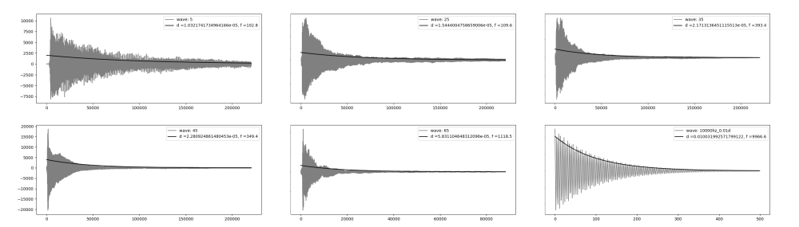

Cabe observar que nos casos dos sons do piano ilustrados nos 5 primeiros retangulos da image o decaimento estimado é para uma das muitas frequências quecompõe a onda, especificamente a de maior intensidade, que compõe a onda. No último retangulo, o decaimento coincide com o envelope da onda, já que esta é composta por apenas uma frequência.
Estamos, desta forma, equipados para introduzir as redes neurais no modelo, de forma a aprender e generalizar o comportamento dos parametros elencados.

### Formulação Final

Podemos escrever as frequências, tanto a fundamental quanto as parciais, em função das teclas de um piano da seguinte forma: $f(k,n)=2^{(k-49)/12}440(n+1), k \in {0,1,...88}, n \in {0,1,2,...}$. Esse framework é conveniente para uma vasta gama de instrumentos, já que essas 88 vão desde A0 até C8. Para treinar a rede a partir de qualquer instrumento, basta rotular os samples com a número da tecla equivalente de um piano. Como pode ser ouvido nos exemplos, esse procedimento permitiu o treinamento de um instrumento híbrido, utilizando samples de um baixo acústico, para o registro mais grave, cello para o meio, e violino para o mais agudo; todos esses instrumentos, ao mesmo tempo, cobriram até a tecla 75 do piano, somente.

Como foi visto, essa equação desconsidera as inarmonicidades presentes nos instrumentos,  responsáveis por características impoprtantes de seus timbres. Contudo, apresenta uma aproximação inicial bastante razoável que serve tanto para reforçar as características harmonicas básicas quanto para aliviar o esforço de predição da rede, na medida em que podemos adicionar um termo de inarmonicidade na equação acima, a ser aprendido pela rede. Temos, assim: $f(k,n)=2^{(k-49)/12}440(n+1)i(k,n), k \in {0,1,...88}, n \in {0,1,2,...}$. Considerando tanto frequências fundamentais quanto parciais no espectro audível, teríamos um intervalo de 27 hz, a frequência fundamental de A0 até um pouco mais de 20Khz, correspondendo, por exemplo, à quinta parcial de C8. Escolhendo prever as inarmonicidades, por outro lado, reduzimos o intervalo para o limite entre 0 e 3. Além disso, o comportamento é bastante bem comportado, com caráter ligeiramente exponencial, como ilustrado a seguir, para a primeira tecla de um piano, e a tecla 34, a última a ter todas as parciais no espectro audível.

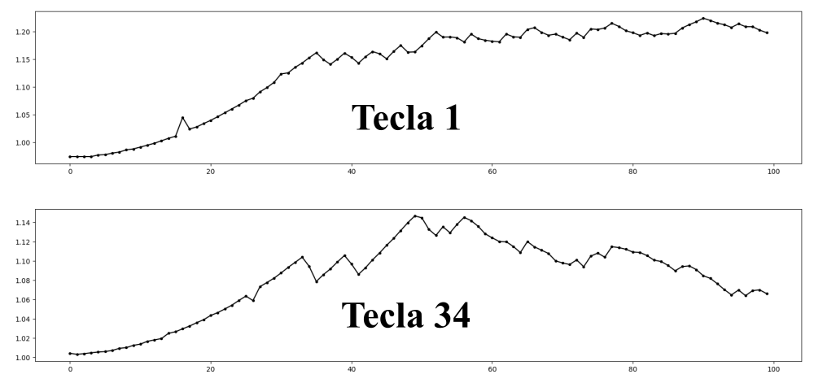

Este mesmo rationale é aplicado aos decaimentos e amplitudes, que são previstos como uma fração dos valores máximos encontrados em cada uma das teclas (ou notas, mais genericamente, no caso de estarmos treinando um instrumento arbitrário), e encontram-se no intervalo fechado entre 0 e 1. O comportamento das amplitudes e decaimentos máximos, por tecla, é apresentado a seguir, e poderia ser, também, modelado, tanto a partir de redes neurais quanto por meio de modelos matemáticos. Empiricamente, contudo, nota-se que os valores médios são suficientes para um bom resultado. Isso é oportuno, pois reduz a complexidade do modelo final, além de conferir mais generalidade: na imagem abaixo notamos, por exemplo, que há uma descontinuidade nos valores dos decaimentos ocorrendo a partir da tecla 55, que deve-se à mudança de cordas duplas para cordas simples. Esse fenomeno é partircular dos pianos, e, além disso, essa descontinuidade é arbitrária, e varia de piano para piano. Teríamos, então, caso não fizessemos uso da média, formular uma aproximação para cada instrumento treinado (ou treinar uma rede adicional). As amplitudes, embora pareçam possuir uma tendêncial geral de diminuição na medida em que avançamos na escala do piano, possuem comportamento bastante arbritrário.

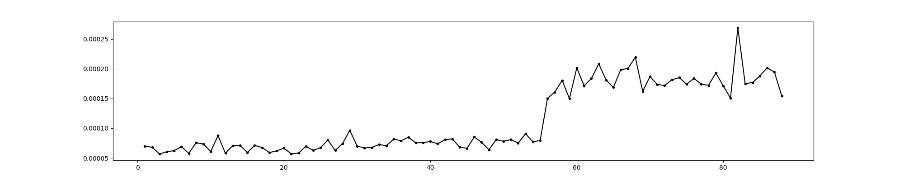

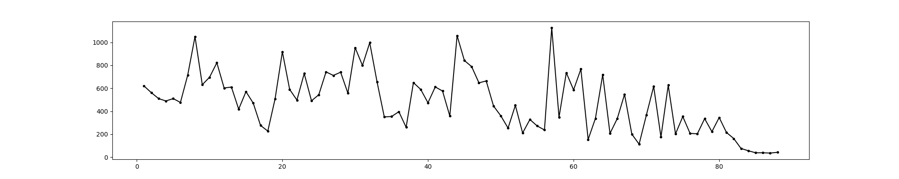

Tendo sido observado que, de posse de uma estimativa do decaimento das frequências parciais, as fases de cada uma delas tem pouco impacto na reconstrução da onda, optou-se por randomizar as fases: Essa decisão confere uma vantagem dupla, diminuindo a quantidade de previsões realizadas pelo modelo e, por conseguinte, o volume de treinamento e posterior processamento necessários econferindo um resultado mais orgânico e variado à sintese executada pelo modelo final, na medida em que nenhuma onda gerada será exatamente igual á qualquer uma outra. Outra opção, menos interessante, seria ainda dar às fases uma valor arbitrário (como zero, por exemplo).

Para a previsão de cada uma das 3 quantidades explicitadas, uma rede densa, com 3 camadas foi utilizada. A arquitetura das 3 redes é identica, com exceção do número de neurons em cada uma das camadas ocultas. Optou-se por utilizar como função de ativação uma versão modificada da tangente hiperbólica, na forma $a(x) = \tanh(6 * x - 3) / 2 + 1 / 2$ de forma a melhor cobrir o intervalo $[0,1]$. Além disso, o método de inicialização de pesos proposto por (TODO:lecun_normal) ofereceu uma melhora considerável no tempo de convergência das redes, e foi a inicialização utilizado na versão final do modelo, tanto para os *neurons* quanto para os *biases*. As redes responsáveis pelas amplitudes e decaimentos possuem 50 neuronios em cada uma das camadas ocultas, e um total de 5 301 parametros treináveis, com aproximadamente 100kb de espaço em disco. Sua arquitetura é apresentada abaixo. Para as frequências, o número de neuronios foi reduzido para 10, para evitar overfitting, o que gera um total de 261 parametros treináveis e aproximadamente metade do tamanho em disco. A figura a seguir compara os dados originais com os produzidos pelo modelo.

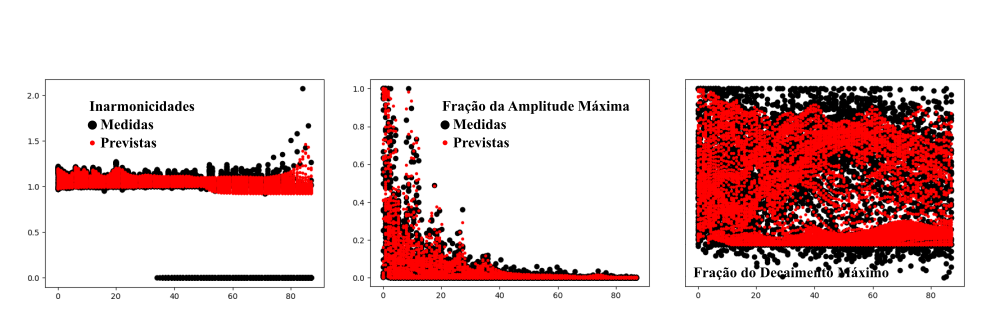

Na pasta [resources/05 Modelo Final/02_predictions/piano/](https://github.com/tesserato/tesserato.github.io/tree/master/resources/05%20Modelo%20Final/02_predictions/piano) do repositório preparado para este trabalho podem ser observadas imagens semlhantes, para outros números de neurons em todas as camadas ocultas, incluindo alguns exemplos em que ocorre *overfitting*.

Podemos, assim, definir uma nova metodologia voltada à modelagem sonora de instrumentos harmonicos, batizada de Neuro-spectral Synthesis, resumida de maneira esquemática na figura a seguir.

TODO:inserir figura esquemática do modelo final

# Resultados

O modelo final apresenta resultados mais realistas do que as implementações baseadas no modelo de Digital Waveguides e no método das diferenças finitas, e é ao menos uma ordem de grandeza mais eficiente, nas implementações aqui apresentadas. Para efeito de comparação, levando em conta a geração de 5 ondas de 1 segundo, a 44100 FPS, o método proposto foi, em média, 17 vezes mais rápido que o método baseado em Digital Waveguides e 26 vezes mais rápido do que o método das diferenças finitas.
A tabela abaixo apresenta os resultados.

|               | Finite Differences | Digital Waveguides | Neuro-Spectral Synthesis |
|---------------|:--------------------:|:--------------------:|:--------------------------:|
| 1             | 16.95213819        | 13.81114888        | 0.5896253586             |
| 2             | 19.62042928        | 13.02065825        | 0.8354649544             |
| 3             | 24.25646234        | 11.33273816        | 0.7555158138             |
| 4             | 17.89053726        | 12.3500874         | 0.7475204468             |
| 5             | 18.00246739        | 12.12223339        | 0.7735056877             |
| **Média**         | **19.34440689**        | **12.52737322**        | **0.7403264523**             |
| **Desvio Padrão** | **2.908692366**        | **0.937300851**        | **0.09102950916**            |
:Comparação Tempo de Geração(s)

Treinadas as redes, uma implementação final do modelo é bastante simples, e é apresentada abaixo.

~~~python
key = 66
partials = 100
n = 44100
fps = 44100

P = np.arange(1, partials + 1, 1)

[ma, Ma] = np.genfromtxt('a_m_M.csv', delimiter=',')
[md, Md] = np.genfromtxt('d_m_M.csv', delimiter=',')
[mf, Mf] = np.genfromtxt('f_m_M.csv', delimiter=',')

a_net = K.models.load_model('a_model.H5', {'scaled_tanh': scaled_tanh})
d_net = K.models.load_model('d_model.H5', {'scaled_tanh': scaled_tanh})
f_net = K.models.load_model('f_model.H5', {'scaled_tanh': scaled_tanh})

f0 = np.power(2, (key - 49) / 12) * 440
norm_key = (key - 1) / 87
ipt = np.array([[norm_key, p] for p in np.linspace(0, 1, partials)])

A = np.ndarray.flatten(a_net.predict(ipt)) * ((Ma - ma) + ma) * 5000
D = np.ndarray.flatten(d_net.predict(ipt)) * ((Md - md) + md) * 0.000113026536390889 #average decay
F = (np.ndarray.flatten(f_net.predict(ipt)) * (Mf - mf) + mf) * P * f0

w = np.zeros(n)
for i in range(partials):
  print('partial:', i)
  ph = np.random.uniform(0, 2 * np.pi)
  w += create_signal(n, fps, F[i], ph, A[i], D[i])
~~~

Uma implementação como essa, funcional, mais os arquivos de definição da arquitetura das redes e seus respectivos pesos estão disponíveis no repositório preparado para este trabalho, em [resources/06 Tempo Real/](https://github.com/tesserato/tesserato.github.io/tree/master/resources/06%20Tempo%20Real), e ocupam aproximadamente 250kb. No repositório podem ser encontradas alguns áudios gerados pelo modelo.

Sua principal limitação é que todos os parametros a serem manipulados no modelo final devem, antes, ter sido incorporados ao processo de treinamento. Os dois paradigmas de modelagem física utilizados para comparação, tanto o método das diferenças finitas quanto os digital waveguides, permitem alguma manipulação em tempo real, a posteriori, de seus parametros: nos exemplos apresentados, o ponto de excitação pode ser mudado de onda para onda e, a qualquer tempo, o ponto de captação pode ser alterado, até mesmo durante a simulação, refletindo no timbre do som gerado. 

Além disso, esses modelos prestam-se à incorporação razoavelmente trivial de uma fonte, contínua ou periódica, de excitação, e podem ser utilizados para a simulação de instrumentos de som continuo, como violinos acionados pelo arco (ao contrario do acionamento *pizzicato* aqui apresentado) e metais, por exemplo; esse não é o caso do modelo aqui proposto, e constitui uma possibilidade de desenvolvimento futuro interessante.

Uma outra barreira é que o modelo aprende características sonoras a partir de exemplos e não presta-se de forma prática à exploração sonora direta; esta deve ser efetuada a partir de outra ferramenta, e então incorporada ao modelo, à época de seu treinamento.

Para ilustração, algumas músicas criadas com os sons gerados pelos modelos propostos, treinados para emular um kit regular de bateria, um piano e um híbrido entre baixo acústico, cello e violino podem ser ouvidos em [soundcloud.com/carlos-tarjano/sets/spectral-neural-synthesis](https://soundcloud.com/carlos-tarjano/sets/spectral-neural-synthesis)

<iframe width="100%" height="300" scrolling="no" frameborder="no" allow="autoplay" src="https://w.soundcloud.com/player/?url=https%3A//api.soundcloud.com/playlists/540745641&color=%23ff5500&auto_play=false&hide_related=false&show_comments=true&show_user=true&show_reposts=false&show_teaser=true&visual=true"></iframe>

Do ponto de vista conceitual, o trabalho apresenta alguns *insights* sobre a transformada discreta de Fourier que, até onde alcança o conhecimento do autor, não foram anteriormente explorados na literatura: A Interpretação geométrica da simetria da transformada discreta de Fourier aplicada à sinais no domínio real, embora não se preste à uma aplicação direta, ajuda no entendimento deste algoritmo e pode vir a ser explorada em desenvolvimentos futuros. 

A relação entre o envelope de uma onda, no domínio do tempo, e o formato de seus picos de frequência no domínio
da frequência, por outro lado, possibilitou a formulação do modelo fisicamente informado, e pode ser explorada futuramente de maneira mais profunda, potencialmente baseando um método mais acurado de identificação de envelopes em ondas sonoras.

# Conclusão

O presente trabalho, ao desenvolver uma nova técnica de modelagem sonora, demonstra o potencial do uso de redes neurais à síntese de áudio, provando sobretudo a possibilidade desse uso em tempo real.
O segundo modelo introduzido apresenta resultados mais verossímeis do que o algoritmo de modelagem acústica em tempo real mais utilizado e eficiente encontrado na literatura, à um custo computacional bastante inferior.

O modelo apresentado, ao ser treinado para a simulação de um piano, demonstra também uma gama de aplicações maior do que o algoritmo digital waveguides, mais aplicável à simulação de instrumentos de corda e sopro TODO:.

Uma outra vantagem frente aos modelos baseados em simulação física é que ele pode aprender características importantes do som que tem origem em partes do sistema difíceis de serem modeladas fisicamente, como a influência de ressonadores de geometria complexa.

Fica evidente ainda o potencial sinergético entre os desenvolvimentos na pesquisa sobre a acústica de intrumentos musicais e a utilização de redes neurais para basear modelos destinados à emulação desses instrumentos, ou famílias de instrumentos, específicos.

## Desenvolvimentos Futuros
As possibilidades de desenvolvimentos futuros nesta área de intersecção entre redes neurais e acústica são inúmeras, haja vista a escassez de investigações semelhantes: Seria interessante, por exemplo, utilizar as saídas de um modelo elaborado a partir do método das diferenças finitas, que pode ser formulado de forma a simular características como rigidez, ressonância e vários termos de perda de um dado sistema acústico, ao custo de uma alta demanda de recursos computacionais, para treinar um modelo baseado em digital waveguides que tenha uma rede neural no ponto onde as perdas e demais cálculos são efetuados.

Devido ao alto grau de recursividade do algoritmo digital waveguides, o treinamento à partir do resultado final esperado para o modelo é bastante complexo de ser implementado; os outputs de uma simulação baseada em diferenças finitas, no entanto, são plenamente compatíveis para este treinamento, e a inserção de uma rede neural pode levar a um modelo que retenha ao menos parte da acurácia da simulação pelo método de diferenças finitas, com eficiência computacional próxima, ou até superior, à apresentada pelo algoritmo de digital waveguides. Em [@gully2017articulatory] encontramos um exemplo de trabalho nesse sentido, que explora o uso de redes neurais para a identificação de parametros relevantes à uma simulação por digital waveguides do trato vocal humano.

Relaxar a simplificação adotada durante o trabalho em relação à decaimentos exponenciais é um outro desenvolvimento futuro com potencial interessante: para algumas categorias de som, como a voz humana por exemplo, o envelope do som apresenta importância maior do que as próprias frequências contidas em relação à características como inteligibilidade TODO:.

Estimar os envelopes com a técnica utilizada no segundo modelo, para mais de dois pontos da onda e utilizar uma rede, possivelmente recorrente, para aprender as características desse envelope para um conjunto de sons de determinado instrumento (possivelmente de excitação continuada), ou mesmo a voz humana, constitui uma interessante direção a ser investigada.

Além disso, um algoritmo eficiente de extração de envelope permitiria retomar a abordagem baseada em *autoencoders* que, alimentados com um senoide pura modelada pelo envelope da onda, teriam maior possibilidade de aprender a reconstruir a onda original de maneira verossímil, em uma abordagem inspirada nas técnicas de transferência de estilo utilizadas no campo da visão de computadores.

Um outro desenvolvimento seria produzir uma implementação em uma linguagem de programação mais eficiente, como C ou C++, somada à uma interface visual e compatibilidade com controladores MIDI pode gerar uma linha de produtos comercialmente viável, a ser comercializado em formato standalone e/ou em formato de *plugin* VST (Virtual Studio Technology), em que um módulo inicial pode ser oferecido e bancos adicionais, consistindo de novas arquiteturas e pesos, podem ser criados e comercializdos mediante a demanda dos usuários ou o desenvolvimento da técnica.

# Referências
